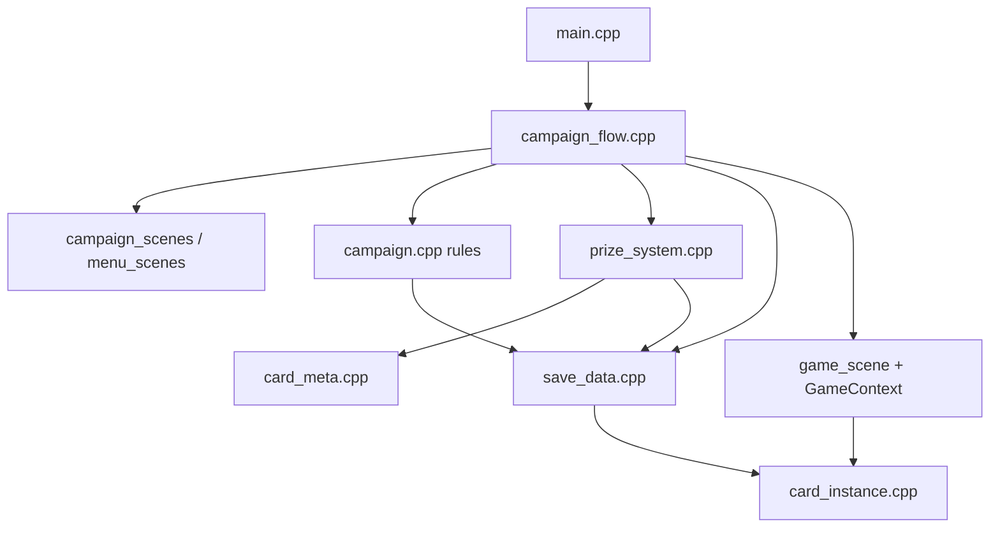

# Campaign Mode — Implementation Plan

**Created:** 2026-08-15  
**Status:** Living plan — architecture-first rollout after initial vertical slice.  
**Canonical tree:** `biggestnumber/` only (not repo-root `src/`).

**Related:** `docs/CAMPAIGN_MODE_HANDOFF.md` (when written), `docs/CAMPAIGN_IMPLEMENTATION_PLAN.md` (this doc).

---

## 1. Goals

| Goal | Why |
|------|-----|
| **One campaign progression system** | Replace roguelike `RunState` + classic high-score loop with a single save-backed campaign |
| **Correct economy** | Library, decks, prizes, copy limits, combo chain — no dupes or silent failures |
| **Upgradeable cards** | Instances + persistence until Sell Collection |
| **Thin scenes, fat domain** | UI scenes render; rules live in testable modules |
| **GBA-safe** | Fixed-capacity containers, SRAM budget, no heap |

---

## 2. Guiding principles (avoid poor programming)

1. **Single source of truth** — rarity, copy caps, combo sequence, prize bands live in **one module** (`prize_system` + `card_meta`), not duplicated in scenes.
2. **Invariants at boundaries** — validate library/deck counts on **every** save write and prize grant; never trust UI alone.
3. **No god `main.cpp`** — orchestration moves to `campaign_flow.cpp`; `main` only boots and loops menus.
4. **Campaign vs battle separation** — `GameContext` handles **battle rules** + mode *modifiers* (Number Now ×0, early end); **win/loss and progression** stay in `campaign` layer after battle returns.
5. **Delete or quarantine dead code** — `run_state`, `run_scenes`, roguelike paths in `main` cause merge errors; remove or `#if 0` with a ticket, not leave half-wired.
6. **Extend, don’t fork** — one `run_prize_row_scene(PrizeOffer[])` for cards + upgrade tiles + trinket tiles; not three copy-pasted loops from `run_drop_pick_scene`.
7. **Save migrations are explicit** — v3→v4 layout documented; never read old SRAM into new struct without a versioned struct.
8. **Instance model is campaign-wide** — one `CampaignInstancePool` in save; battles copy pool into `BattleLaunch`; no “classic = CardType only, campaign = instances” long term.
9. **Small PR-sized phases** — each phase compiles, playable, and manually testable before the next.

---

## 3. Target architecture



### Module responsibilities

| Module | Owns | Must NOT own |
|--------|------|----------------|
| `save_data` | SRAM layout, migrations, deck CRUD, library counts, validation | Prize logic, battle rules |
| `campaign` | Win/loss rules, mode setup, starter deck, apply win, sell collection | Sprite layout, input polling |
| `prize_system` | Slot rarities, combo next, build `PrizeOffer[3]`, eligibility | Scene rendering |
| `campaign_scenes` | Menus, prize row UI, results, trinket row UI | Copy limit math |
| `campaign_flow` | Play submenu loop, battle→results→prize→trinket sequence | Card effects |
| `GameContext` | Battle sim, mode modifiers (NN), details panel content | `total_wins`, library |
| `card_instance` | Pool, upgrades, effective +N/×2, gravity flags | Save migration |

### Data model (target)

```text
SaveData v4 (global campaign)
├── library_counts[CardType]     — owned copies (prizes add here)
├── campaign_instance_pool       — up to 50 CardInstance (packed or full)
├── decks[6]                     — counts + 2 trinkets + name; NOT owning cards outside library
├── active_deck_index
├── biggest_number_record, total_wins, same_number_*, number_now_round_best[]
├── trinket_owned[]
└── campaign_ready

Invariant: ∀ type: sum(deck counts) ≤ library_counts ≤ max_copies meta
Invariant: each deck copy maps to instance_id OR derive from pool order (pick one strategy in Phase 3)
```

**Decision (Phase 3):** Prefer **explicit instance ids per deck slot** in save (flatten order stable) OR rebuild pool from decks on load — document chosen approach; do not mix.

---

## 4. Current state (slice landed)

| Area | Status |
|------|--------|
| Save v4 skeleton | Done — needs invariant enforcement on write |
| Main menu 2-item | Done |
| Starter pick + 6-card deck | Done |
| Play submenu + 3 modes | Done |
| Win rules (BN / SN / NN) | Done |
| Number Now early end + ×0 rounds | Done in `GameContext` |
| Prize row (cards + upgrade stub) | Partial — upgrade not applied |
| Combo chain + bands | In `campaign.cpp` — should move to `prize_system` |
| Trinket grant (collection flag) | Minimal — no card-row UI |
| TOPPINGS card | Done (placeholder art) |
| Roguelike `run_*` | **Dead code** — still in tree |
| Deck editor library limits | **Not done** |
| Sell collection | **Not done** |
| L/R status | **Not done** |
| Details panel per mode | **Not done** |

---

## 5. Key architectural decisions (lock before Phase 2+)

| # | Decision | Recommendation | Rationale |
|---|----------|----------------|-----------|
| D1 | Repo root `src/` | **Stop editing**; optional delete or README pointer | Dual-tree drift |
| D2 | Roguelike code | **Removed** — `run_state`, `run_scenes`, classic play/complete scenes | Done (Phase 0) |
| D3 | Prize UI | **One** `prize_row_scene` driven by `PrizeOffer` | Cards, upgrades, trinkets same layout |
| D4 | Upgrade persistence | **Instance pool in SaveData v4** (extend, don’t new v5 yet) | Upgrades survive until sell |
| D5 | Deck ↔ instance | **Flatten active deck to `CardRef[]` at battle start** from pool | Reuse battle pipeline |
| D6 | `score_to_beat` / details | **`CampaignUiContext` on `BattleLaunch`** (mode, targets, records) | Stop overloading `score_to_beat` |
| D7 | Number Now modifiers | Keep in `GameContext` | Tightly coupled to round commit |
| D8 | Prize bands | `prize_system_slot_rarities(mode, inputs)` calls `card_meta` merge | Single threshold table |
| D9 | Same Number target | Roll in `campaign_prepare_same_number_target`; persist until win | Already agreed |
| D10 | Win #5 + #10 | `apply_win` → prize → if `wins%10==0` trinket scene | Already agreed |
| D11 | MAX decks | 6 (saved in v4) | Already agreed |
| D12 | Trinkets | Collection + 2 active per deck in editor | Already agreed |

---

## 6. Implementation phases

### Phase 0 — Stabilize & hygiene (do first)

**Goal:** Clean build, no dead entry points, documented SRAM.

| Task | Files |
|------|-------|
| Verify `make` on dev machine; fix compile errors from slice | all |
| Remove roguelike sources (`run_state`, `run_scenes`) and dead menu paths | `run_*`, `menu_scenes.*`, `card_meta.*` |
| Remove roguelike from `main.cpp` imports unused `run_*` | `main.cpp` |
| Add `docs/CAMPAIGN_MODE_HANDOFF.md` (player-facing rules summary) | docs |
| Document SaveData v4 byte layout + max size | this doc §7 |
| Add `save_data_validate(SaveData&)` — clamp/fix invariants before write | `save_data.cpp` |
| Rename confusing fields: `campaign_ready`, document `active_deck_index` | `save_data.h` |

**Exit criteria:** Builds; fresh save → starter → one win → prize adds library; no roguelike menu item.

---

### Phase 1 — Inventory correctness

**Goal:** Library and decks cannot enter invalid states.

| Task | Detail |
|------|--------|
| `library_assign_to_deck` / `library_remove_from_deck` | Adding to deck consumes library availability |
| Deck editor uses **library_available**, not `LIBRARY_COPY_LIMIT` alone | `deck_editor_scene.cpp` |
| `saved_deck_add_card` checks global library | `save_data.cpp` |
| Prize adds to library only (not auto-add to active deck) | `campaign_apply_prize_card` |
| Combo chain: max 1 per combo card in **library** | already in prize build |
| Cap decks at 6 in UI | `menu_scenes.cpp` |

**Exit criteria:** Cannot exceed copy limits; removing from deck frees library slot for reassignment.

---

### Phase 2 — Prize system module + unified picker

**Goal:** One code path for all prize rows; bands/combo centralized.

| Task | Detail |
|------|--------|
| Create `prize_system.h/.cpp` | Move from `campaign.cpp`: `build_prize_offers`, combo sequence, band drivers |
| Create `prize_row_scene.h/.cpp` | Generalize `run_drop_pick_scene` row renderer for `PrizeOffer` |
| Upgrade tiles: `PrizeSpriteKind` maps to sprite items (your card-size art) | graphics + small lookup table |
| Trinket tiles: same row scene, `PrizeOfferKind::TRINKET` | Phase 2b or 3 |
| `campaign_scenes.cpp` becomes thin wrappers | Calls `run_prize_row_scene` |
| Retune thresholds in one place | `card_meta.cpp` or `prize_system` constants |

**Exit criteria:** Win always shows 3 offers; flex slot = combo OR upgrade on #5; inspect works for all kinds.

---

### Phase 3 — Campaign instances + upgrades

**Goal:** Upgrade prizes apply and persist until Sell Collection.

| Task | Detail |
|------|--------|
| Extend `SaveData` with `InstancePool` or packed `SavedInstance[50]` | migration: empty pool |
| `campaign_pool_add(type)` on library add for **new** copies | or on first deck assign |
| `run_upgrade_target_scene` — pick card from **active deck** row UI | reuse card row |
| Apply: +digit, ×2, Lead, Yeast (no Remove) | `card_instance.cpp` |
| Battle: flatten deck → `CardRef[]` with instance ids | `campaign_flow.cpp` |
| Sell Collection clears pool + upgrades | Phase 6 |

**Exit criteria:** Win #5 → pick upgrade → pick target → battle shows modified +N / pip; reload persists.

---

### Phase 4 — Deck editor & active deck

**Goal:** Full builder UX from design.

| Task | Detail |
|------|--------|
| Mark **active deck** (star / label in list) | `menu_scenes`, save |
| Name decks (existing) | keep |
| Trinket loadout: 2 slots, from `trinket_owned` only | `deck_editor_scene` |
| Build from **library catalog** (owned cards), not infinite stub | editor grid filter |
| Play Game uses **active deck** (not pick list) OR pick list sets active | design: use active |
| Enforce 1–50 cards per deck | existing |

**Exit criteria:** Switch active deck; trinkets load in battle; editor respects library.

---

### Phase 5 — Battle UX per mode

**Goal:** Left/details panel and HUD match mode.

| Task | Detail |
|------|--------|
| `CampaignUiContext` on `BattleLaunch` | replaces overloading `score_to_beat` |
| Details panel strings per mode | `sync_details_panel` |
| Biggest Number: best record | done-ish |
| Same Number: target N | |
| Number Now: scoring round #, per-round record | |
| Optional: round markers for NN “×0 rounds” in Future Rounds section | |

**Exit criteria:** Each mode shows distinct details panel; no misleading “Biggest Number” label in SN/NN.

---

### Phase 6 — Meta UI & Sell Collection

| Task | Detail |
|------|--------|
| L/R on menus → `run_campaign_status_scene` | wins until upgrade/trinket, records, library size |
| Sell Collection entry (Build Deck or status) | dialogue |
| Pick 1 nostalgia card → reset tallies, pool, trinkets, library except wheels + kept + utility pick | |
| Utility pick again after sell | `run_campaign_starter_pick_scene` |

**Exit criteria:** Full reset works; one card survives; new bracket on Same Number.

---

### Phase 7 — Content & tuning

| Task | Detail |
|------|--------|
| TOPPINGS + upgrade + trinket prize sprites | `graphics/`, `convert_sprites.py` |
| Production drop thresholds (30k/100k) when scores warrant | `card_meta` |
| Same Number random weights playtest | `prize_system` |
| Manual test matrix (§8) all green | |

---

### Phase 8 — Optional battle refactor (not a campaign gate)

| Task | Detail |
|------|--------|
| Wire play_resolution #2d remaining paths if bugs found | `game_input.cpp` |
| Echo instance fidelity | `game_context.cpp` |
| Split `game_input` / `game_render` | `HANDOFF.md` |

---

## 7. SRAM & memory budget

| Block | Estimate |
|-------|----------|
| SaveData v4 (decks + library + stats) | ~2–3 KB |
| Instance pool (50 × ~8 B) | ~400 B |
| **Total campaign save** | **< 4 KB** (GBA SRAM 64 KB — fine) |

**Rule:** Before adding fields, update this table. Use `uint8_t` counts, `int32_t` scores only where needed.

---

## 8. Manual test matrix (run each phase exit)

| # | Steps | Expected |
|---|--------|----------|
| T1 | Fresh save → Play → utility pick | 6-card deck, main menu return |
| T2 | Biggest Number win / loss | Record updates only on win; prize only on win |
| T3 | Same Number exact N | Win only on `== N`; same N until win |
| T4 | Number Now | Ends after scoring round; ×0 on others |
| T5 | Win #5 | Upgrade tile in flex slot |
| T6 | Win #10 | Prize then trinket scene |
| T7 | Combo prizes | PB→Jelly→… sequential; one combo on row |
| T8 | Copy limit | No offer above max; library enforces |
| T9 | Sell Collection | Reset + nostalgia card |
| T10 | Reload after upgrade | Instance modifiers persist |

---

## 9. Risks & mitigations

| Risk | Mitigation |
|------|------------|
| Dual-tree drift (`bn/src` vs `biggestnumber`) | Edit only `biggestnumber/`; delete or archive root |
| `GameContext` grows campaign conditionals | `CampaignUiContext` + post-battle campaign layer |
| Instance/deck desync | Single rebuild function `campaign_flatten_active_deck` |
| Prize logic duplicated | `prize_system` only |
| SRAM corruption on migration | Versioned read structs; validate after migrate |
| Scene megafunctions | Extract `prize_row_scene` early (Phase 2) |
| Upgrade UI without sprites | Temporary text inspect OK; sprites Phase 7 |

---

## 10. Suggested work order (summary)

```text
Phase 0  Stabilize (build, validate save, remove dead roguelike entry)
Phase 1  Library/deck invariants + editor consumption
Phase 2  prize_system + unified prize_row_scene
Phase 3  Instance pool in save + upgrade application
Phase 4  Active deck + trinket loadout in editor
Phase 5  Details panel / CampaignUiContext
Phase 6  Status L/R + Sell Collection
Phase 7  Art + threshold tuning
Phase 8  Battle refactor (as needed)
```

**Do not parallelize Phase 3 before Phase 1** — upgrades on wrong inventory model multiply bugs.

---

## 11. Changelog

| Date | Change |
|------|--------|
| 2026-08-15 | Initial architecture-first implementation plan |
