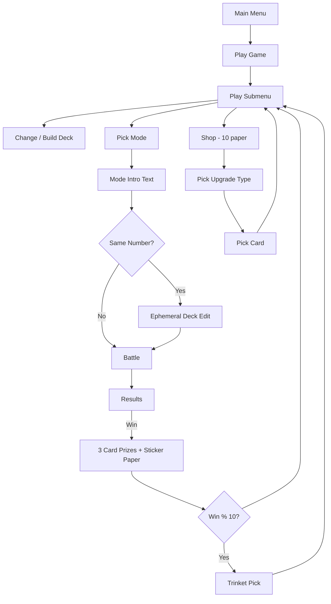

# Campaign Feature Plan — August 2026

**Created:** 2026-08-31  
**Status:** Planning — not yet implemented.  
**Purpose:** Roadmap for rarity updates, sticker-paper economy, card reworks, bug fixes, and new game modes.

**Related docs:** `docs/CAMPAIGN_IMPLEMENTATION_PLAN.md`, `docs/ROGUELIKE_RUN_HANDOFF.md` (§6 rarity table), `docs/GAME_DESIGN_BRD.md`

---

## Summary

| # | Feature | Effort | Depends on |
|---|---------|--------|------------|
| 1 | Update card rarities | Small | Designer table |
| 2 | Sticker paper + shop | Medium | Save migration |
| 3 | Longsleeves index fix | Small | — |
| 4 | Palindrome prize gate (> 11011) | Small | — |
| 5 | Same Number ephemeral deck edit | Medium | Deck editor reuse |
| 6 | Bones rework (×(1+n) only) | Small | — |
| 7 | Tombstones rework (+n from GY) | Small | — |
| 8 | New game modes + intro text | Large | Mode enum, UI |

---

## Recommended implementation order

| Phase | Items | Why |
|-------|-------|-----|
| **A — Quick fixes** | Bones, Tombstones, Palindrome gate | Small, isolated changes in `play_resolution.cpp` / `prize_system.cpp` |
| **B — Bug fix** | Longsleeves | Blocking trinket usability |
| **C — Economy** | Sticker paper + shop | Touches save data, menus, prize flow |
| **D — Content** | Rarities | Needs target table; one-file change once decided |
| **E — Modes** | Same Number deck, new modes + intros | Largest scope; some modes share infrastructure |

---

## 1) Card rarities

### Current state

Rarities live in `src/card_meta.cpp` (`META_TABLE[]`). They affect prize pools, copy limits, and border colors — **not** in-battle effects.

Access: `const CardMeta& card_meta(CardType type)` in `include/card_meta.h`.

### Problem

Code and design doc disagree. Example mismatches:

| Card | Code (`card_meta.cpp`) | Design doc (`ROGUELIKE_RUN_HANDOFF.md` §6) |
|------|------------------------|---------------------------------------------|
| Rip Stick, Bike | Uncommon | Common |
| RPS pieces (Rock/Paper/Scissors) | Rare | Common |
| Shoot | Rare | Rare |
| Lifeline | Uncommon | Rare |
| Wishes | Uncommon | Rare |

**Code tally:** Common 17 · Uncommon 31 · Rare 23  
**Doc tally:** Common 18 · Uncommon 22 · Rare 11

### Plan

1. Garrett provides the authoritative rarity + max-copies table.
2. Update `META_TABLE[]` in `src/card_meta.cpp`.
3. Sync `docs/ROGUELIKE_RUN_HANDOFF.md` §6.
4. Smoke-test prize rolls at different win counts / modes.

### Open questions

- [ ] Updated table ready, or reconcile code vs. design doc together?

---

## 2) Sticker paper economy + shop

### Current state

**Sticker paper is not implemented.** Every 5th win, prize slot 1 (flex) offers a random upgrade instead of a combo card (`prize_should_include_upgrade()` in `src/prize_system.cpp`).

### Target design

- Every win → always receive sticker paper (in addition to 3 card picks, or as guaranteed 4th slot — TBD).
- Upgrades cost **10 sticker paper**, purchased from a **Shop** in the play menu.
- Remove the every-5-rounds upgrade prize.

### Implementation plan

```
SaveData
  + sticker_paper: uint16_t  (bump SAVE_DATA_VERSION, migrate in save_data.cpp)

Prize flow (campaign_flow.cpp → campaign_scenes.cpp)
  After win → prize scene → auto-grant sticker paper (amount TBD)
  Remove prize_should_include_upgrade(); flex slot always combo/card

Shop (new scene or extend campaign_scenes.cpp)
  Play menu item: "Shop (N paper)"
  → Show balance
  → Pick upgrade type (+Digit / ×2 / Lead / Yeast)  [reuse run_scenes.cpp pattern]
  → If balance >= 10: run_upgrade_target_scene() → campaign_apply_prize_upgrade() → deduct 10
  → Else: show "Need 10 sticker paper"

UI cleanup
  Replace "Upgrade in N" (campaign_wins_until_upgrade) with sticker paper balance
  Show balance in deck editor status panel + L-status screen
```

### Key files

| File | Change |
|------|--------|
| `include/save_data.h` | Add `sticker_paper` field |
| `src/save_data.cpp` | Migration |
| `include/campaign_types.h` | Optional `PrizeOfferKind::STICKER_PAPER` |
| `src/prize_system.cpp` | Remove every-5 upgrade; optional sticker paper offer |
| `src/campaign_scenes.cpp` | Shop menu item + scene |
| `src/campaign_flow.cpp` | Wire shop into flow |
| `src/campaign.cpp` | `campaign_spend_sticker_paper()` |
| `src/deck_editor_scene.cpp` | Show balance in status panel |

### Reference UI

`run_upgrade_node_scene()` in `src/run_scenes.cpp` — upgrade type menu pattern (adapt for campaign + cost check).

### Open questions

- [ ] How much sticker paper per win? (1? scales with performance?)
- [ ] Auto-grant alongside card pick, or 4th pickable prize slot?
- [ ] Shop in play submenu, main menu, or both?

---

## 3) Longsleeves index error

### Current flow

1. Equipping **Longsleeves** trinket in deck editor calls `run_longsleeve_deck_pick_scene()` twice (pick 1/2, pick 2/2).
2. Pool = collection instances **not in saved deck**.
3. Resolved at battle start → `launch.longsleeve_cards` → `state.longsleeve_cards` (max 2).

### Likely bug locations

| Issue | Location | Fix |
|-------|----------|-----|
| Pick 2 soft-lock if only 1 out-of-deck card | `longsleeve_pick_scene.cpp` | Filter `existing[0]` from pool on pick 2 |
| Uses **saved** deck, not editor working deck | `build_out_of_deck_refs()` | Pass working deck contents from editor |
| `deck_index == -1` for unsaved decks skips exclusion | `deck_editor_scene.cpp` | Block longsleeve equip until deck saved |
| Cancel on pick 2 leaves trinket equipped | `deck_editor_scene.cpp` | Check return value; revert trinket on cancel |
| In-battle `hand_index` = longsleeve slot 0/1, not visual index | `game_input.cpp` | Use `PlayPresentOrigin::LONGSLEEVE` or visual index |

### Key files

- `src/longsleeve_pick_scene.cpp`
- `include/longsleeve_pick_scene.h`
- `src/deck_editor_scene.cpp`
- `src/save_data.cpp` (`saved_deck_resolve_longsleeve_cards`)
- `src/game_input.cpp`
- `src/game_context.cpp`

### Plan

Fix pick-scene pool logic first, then in-battle index separation, then editor integration polish.

---

## 4) Palindrome prize gate

### Current

Palindrome is **COMMON**, max 5 copies — eligible in any COMMON prize pool with no score requirement.

### Target

Only offerable when `biggest_number_record > 11011`.

### Plan

1. Add `palindrome_prize_eligible(const SaveData&)` helper.
2. Filter in `collect_eligible_library()` (`src/prize_system.cpp`).
3. Also filter in roguelike `roll_drop_offers()` if that path is still active.

**Note:** In-battle play is unchanged — only prize/drop eligibility is gated.

---

## 5) Same Number — temporary deck editing

### Current

All modes use the saved active deck as-is (`campaign_flatten_deck()` in `campaign_flow.cpp`). No pre-battle deck modification.

### Target

Before a Same Number battle, let the player add/remove cards from their collection for **this round only**. Changes are **not** written back to the saved deck.

### Plan

```
Same Number flow (campaign_flow.cpp)
  Select Same Number
  → NEW: run_same_number_deck_scene(save, working_deck)
      - Clone active deck into temporary instance list
      - Deck editor UI in "ephemeral" mode (reuse deck_editor_scene patterns)
      - Pool = full library
      - Confirm → battle with working_deck
      - Cancel → back to play menu
  → Battle (existing)
  → Discard working_deck (never save)
```

### Open questions

- [ ] Deck size limits — same as saved deck?
- [ ] Library-only adds (assume yes)?
- [ ] Replace "Change / build deck" for Same Number, or additional step?

### Reuse

Parameterize `deck_editor_scene.cpp` with `DeckEditMode::EPHEMERAL`.

---

## 6) Bones rework

### Current (`src/play_resolution.cpp`)

On GY entry when Bones is played to graveyard:

1. `+graveyard_count` (includes self)
2. `×(bones_in_gy + 1)`

### Target

Only `×(1 + n)` where `n` = number of **Bones** cards in graveyard **including the one just played**. Minimum **×2**.

### Plan

```cpp
// New apply_bones_gy_entry:
const int n = count_bones_in_graveyard(state); // self already in GY
const int factor = 1 + n;  // always >= 2 when Bones enters GY
state.mul_from_card(factor);
// Remove the +graveyard_count add entirely
```

Also update previews in `src/game_helpers.cpp` and playability check (currently requires `graveyard.size() > 0`).

### Open questions

- [ ] Always playable (always ×2), or still require non-empty GY?

---

## 7) Tombstones rework

### Current

- On play: `+3` (`effect_tombstones_play` in `card_data.cpp`)
- On GY entry: `×unique_card_types_in_graveyard`

### Target

Just `+n` where `n` = total cards in graveyard.

### Plan

```cpp
// Replace both effects with single GY-entry add:
const int n = state.graveyard.size(); // includes self after routing
state.add_from_card(n);
```

Remove `effect_tombstones_play` and `apply_tombstones_gy_entry` multiply. Update previews in `game_helpers.cpp`.

### Open questions

- [ ] Does `n` include Tombstones itself (min +1), or only other GY cards?

---

## 8) New game modes + intro text

### Intro text box (all modes)

Add a confirmation/info screen before each battle:

```
run_mode_intro_scene(CampaignMode mode, CampaignUiContext ctx)
  → Display mode-specific description (multi-line text box)
  → A = Start battle
  → B = Back to play menu
```

Wire into `campaign_run_play_flow()` between mode selection and `run_campaign_battle()`.

### Mode catalog

| Mode | Status | Intro text | Win condition |
|------|--------|------------|---------------|
| **Biggest Number** | Exists | Score higher than your previous biggest number!\n(Record: X) | `final > record` |
| **Same Number** | Exists | Score exactly (the number) | `final == target` |
| **Score Now!** | Exists as `NUMBER_NOW` | Score all your points on round R!\n(R = scoring round, no ×0 on that round) | Beat round record on scoring round |
| **Ain't Got Time for This** | **New** | Score all your points in the first 3 rounds! | Best total after round 3; later rounds ×0 |
| **Sharing is Caring** | **New** | Each round starts with ×5 round mult.\nEach card played: mult −1 | TBD (BN-style record?) |
| **Poker Hand** | **New** | Build a poker hand with digits from your cards! | Best poker hand from 5 digit slots |

### Ain't Got Time for This

- Extend `CampaignMode` enum in `include/campaign_types.h`
- After round 3, subsequent rounds apply ×0 end-of-round multiplier
- New save record field: `aint_got_time_record` (or shared BN record — TBD)

### Sharing is Caring

- `round_start_multiplier = 5` on `GameState`
- Decrement by 1 each card played (`cards_played_this_round` already tracked)
- Applied as round score multiplier at end of round

### Poker Hand

Largest new mode. Reuse `build_a_number` infrastructure with **5 slots** instead of 3.

- Battle UI: replace round/total score with 5 digit slots (single set — no separate round/total)
- Playing a card places its digit into next empty slot (same digit extraction as Build a Number card)
- At end of battle (or when 5 slots filled): evaluate poker hand rank

**Suggested scoring table (needs confirmation):**

| Hand | Points (suggested) |
|------|-------------------|
| High card | assembled 5-digit number |
| Pair | ×10 |
| Two pair | ×100 |
| Three of a kind | ×1000 |
| Straight | ×10000 |
| Full house | ×100000 |
| Four of a kind | ×1000000 |
| Five of a kind | jackpot |

**Reference code:** `GameState::build_a_number_*` in `include/game_state.h`, `GameMode::BUILD_NUMBER_DIGIT` in `include/game_types.h`.

### CampaignMode enum expansion

```cpp
enum class CampaignMode : uint8_t {
    NONE,
    BIGGEST_NUMBER,
    SAME_NUMBER,
    NUMBER_NOW,        // display: "Score Now!"
    AINT_GOT_TIME,
    SHARING_IS_CARING,
    POKER_HAND,
};
```

Play menu grows from 4 → 7+ items (plus Shop). May need scrolling menu or sub-menu grouping.

### Open questions

- [ ] Poker Hand: point values per rank?
- [ ] Poker Hand: round structure (play until deck empty / 5 slots filled)?
- [ ] Separate high scores per mode, or shared records?
- [ ] Sharing is Caring win condition?

---

## Architecture diagram (post-changes)



---

## Open questions checklist

- [ ] **Rarities** — Updated table ready?
- [ ] **Sticker paper** — Amount per win? Auto-grant vs. pickable slot?
- [ ] **Tombstones** — `+n` includes self?
- [ ] **Bones** — Always playable?
- [ ] **Poker Hand** — Scoring table, rounds, win condition?
- [ ] **Mode records** — Per-mode or shared?
- [ ] **Implementation priority** — Which phase (A–E) first?

---

## File index (quick reference)

| Area | Primary files |
|------|----------------|
| Rarities | `src/card_meta.cpp`, `include/card_meta.h` |
| Prizes | `src/prize_system.cpp`, `src/campaign_scenes.cpp` |
| Save | `include/save_data.h`, `src/save_data.cpp` |
| Campaign flow | `src/campaign_flow.cpp`, `src/campaign.cpp` |
| Longsleeves | `src/longsleeve_pick_scene.cpp`, `src/deck_editor_scene.cpp` |
| Card effects | `src/play_resolution.cpp`, `src/game_helpers.cpp`, `src/card_data.cpp` |
| Modes | `include/campaign_types.h`, `src/campaign_scenes.cpp` |
| Build-a-number / Poker | `include/game_state.h`, `src/game_context.cpp`, `src/game_helpers.cpp` |
