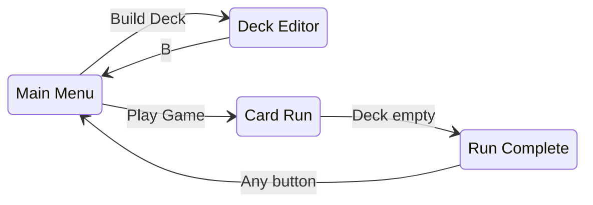
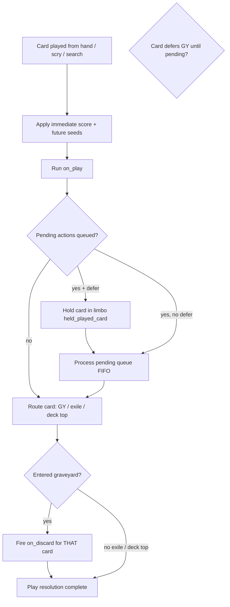
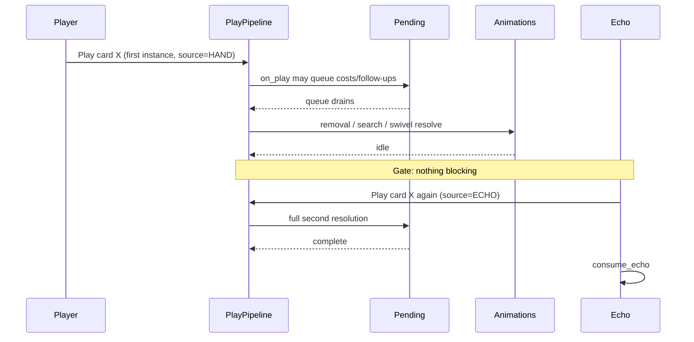

# Biggest Number — Game Design BRD (As Implemented)

**Status:** Living document — describes **current behavior in code**, not future RPG/overworld plans.  
**Purpose:** High-level design reference for refactoring, playtesting, and clarifying intent.  
**Last synced with codebase:** August 2026 (52 cards, save v3).

> **How to use this doc:** Edit freely. Mark sections `[CONFIRMED]`, `[CHANGE REQUEST]`, or `[OPEN]` as you review. Ambiguities and open questions are collected in §16.

---

## 1. Product summary

**Biggest Number** is a GBA card game built with [Butano](https://butano.readthedocs.io/). The player builds a deck (1–25 cards), runs a single battle against a shuffled copy of that deck, plays cards from hand to maximize **total score**, and compares against a per-deck high score.

There is **no opponent** and **no lose state** in the current build — only run completion when the draw pile is exhausted.

---

## 2. Player goals

| Goal | Detail |
|------|--------|
| **Primary** | Maximize `total_score` by the end of the run |
| **Secondary** | Beat the saved high score for the chosen deck |
| **Collection** | Build decks from up to 5 copies of each of 52 card types |

---

## 3. Run structure

### 3.1 Phases



### 3.2 Battle run

| Rule | Value | Notes |
|------|-------|-------|
| Starting deck | Player's saved deck, shuffled | Battle deck is a **disposable copy** — in-run changes do not persist |
| Round start draw | Up to **5** cards | Fewer if deck is low; plus any `draw_at_start` seeds |
| Round end | **Hand is empty** and all pending actions resolved | Not a fixed round count |
| Run end | **Draw pile empty** at round boundary | `game_over` / `run_finished`; `final_score = total_score` |
| Hand size cap | 60 | `bn::vector` limit |
| Graveyard cap | 50 | |
| Deck size cap | 25 | |

### 3.3 Round counter

- `current_round` starts at **1** and increments at each `start_new_round()`.
- Used by cards like **Time is Too Expensive** (`+current_round`) and **Semaphore** (round-1 first-card bonus).

---

## 4. Scoring system

### 4.1 Two score fields

| Field | Meaning |
|-------|---------|
| **Round score** | Working score for the current round (`running` × `end_multiplier`) |
| **Total score** | Persistent sum across committed rounds |

### 4.2 Round score math

- **Adds** (`add_from_card`): increase `running`.
- **Immediate multipliers** (`mul_from_card`): multiply `running` in place (e.g. ×3 on round score).
- **End multipliers** (`apply_seed_multiply` / scheduled): stack **additively** into `end_multiplier` (×3 then ×5 → ×8). First multiplier replaces default 1.
- **Committed round score:** `running × end_multiplier`.
- **Round commit** (`commit_round`): add committed round score to `total_score`, reset round fields.

### 4.3 Future-round seeds (3-slot ring)

Cards can seed effects for the **next 3 rounds** (`future_mods[3]`):

| Seed field | Applied at round start |
|------------|------------------------|
| `positive` | `add_from_card` to new round |
| `multiply` | `apply_seed_multiply` (end multiplier seed) |
| `draw_at_start` | Extra cards drawn with the normal 5 |

Slots rotate each round (`next_mod_index`).

### 4.4 Turtle Mode (delayed commit)

- Playing **Turtle Mode** sets `turtle_rounds_remaining = 3`.
- While active: round score is **not committed** each round; `round` score **carries** across sub-rounds.
- When counter reaches 0: commit once, then normal flow resumes.

### 4.5 Score display

- Round HUD shows `running` or `M(running)` when `end_multiplier ≠ 1` (e.g. `3(12)`).
- See `include/scoring.h` for formatting rules.

### 4.6 Card-sourced vs trinket-sourced scoring

- **`add_from_card`**: any positive add from cards, combos, discard effects, future seeds.
- **Trinket adds** (Morel, Lucky Sevens, Get With the Times round start): must **not** use `add_from_card` — trinkets have separate hooks.

### 4.7 Point-modifier reaction stack

After each **addition** to round (or total), the new value is scored against trinket procs **before** later additive modifiers on the same play resolve:

1. Card / seed / combo `add_from_card` applies → score check (Lucky Sevens, Prime Time, …).
2. Any triggered reactions fully resolve (e.g. Lucky Sevens roulette → flight → apply → nested score checks).
3. Deferred additive modifiers flush next (Morel +2 per queued add), each with its own score check before the next deferred stack entry.

So if a card adds 1 and the post-add total would proc Lucky Sevens, Lucky resolves first; Morel’s +2 applies afterward and is evaluated on its own.

---

## 5. Zones and card movement

| Zone | Behavior |
|------|----------|
| **Deck** | Draw pile (undrawn + drawn tracking); shuffle, scry, search, exile |
| **Hand** | Playable cards; max 60 |
| **Graveyard** | Played/discarded cards; max 50; LIFO for cursor default |
| **Exile** | Removed from run entirely (not in GY); no discard triggers |
| **Held (limbo)** | `held_played_card` — card waiting for pending UI before entering GY |

### 5.1 Play destination rules

| Flag / case | Destination |
|-------------|-------------|
| Default play | Graveyard, then discard effect |
| `exiles_self_on_play` (Necromancy) | Exile; never GY |
| `defer_graveyard_until_pending` (Clover, Jacks, Fishing Pole, Cups, Seeds) | Held until pending queue empty, then GY + discard |
| **Swivel waiting** | Next played card → **deck top** instead of GY |
| Combo resolution | Matched cards **removed** from zone (not discarded) |

### 5.2 Discard effect timing

**Discard effects fire when the card enters the graveyard**, not on exile or combo removal.

The card is **already in the GY** when its own discard effect runs. **Bones** uses `graveyard.size()` at that moment — **including itself** — so discarding Bones alone gives +1.

### 5.3 Card resolution model `[CONFIRMED framework]`

Most card quirks become predictable once you separate **playing a card** from **a card entering the graveyard**. Clover is not a special case of discard timing — it is a **play cost** that must resolve before the played card finishes.

#### Two orthogonal concepts

| Concept | When | Question it answers | Examples |
|---------|------|---------------------|----------|
| **Play resolution** | Card leaves hand (or scry/search) and its play effect runs | What must happen for this play to finish? | +N, scry, exile picks, discard-as-cost |
| **Graveyard entry trigger** (`on_discard`) | A card **enters** the graveyard | What happens now that this card is in the GY? | Bones, Busted, Threshold, Tombstones (discard), Roll Over (discard) |

**Key rule:** `on_discard` is **not** a cost to play a card. It is a **reaction to arriving in the graveyard** — whether that arrival is from playing the card, being discarded as someone else's cost, or a normal discard.

#### Play resolution pipeline



#### Play costs vs play follow-ups

Within **play resolution**, pending actions fall into two buckets:

| Bucket | Meaning | Card must wait in limbo? | Examples |
|--------|---------|--------------------------|----------|
| **Play cost (held)** | Cost must complete before the playing card enters any zone | **Yes** — `defer_graveyard_until_pending` | Clover (exile 3 GY → ×3), Jacks / Fishing Pole / Cups, Seeds |
| **Play cost (early GY)** | Discard cost must complete before payoff; playing card **already in GY** during cost UI | **No** — route to GY immediately after `on_play` | **Big Kurosawa Burger** (discard 1 → ×4) |
| **Play follow-up** | Extra steps after the card leaves hand; payoff not gated on a cost | **Usually no** | Pilot / Librarian (scry), Hacker (deck search), Rags (exile loop), Swap |

**Clover** fits the model as: `on_play` queues a **play cost** (exile exactly 3 from GY); the card is **held** until that cost is paid; only then does it enter the GY (no `on_discard`). The exile is the price of the ×3, not a discard trigger.

**Bones** fits the model as: nothing on play; whenever Bones **enters** the GY, `on_discard` runs and counts cards in the GY **including itself**.

#### Big Kurosawa Burger — play cost with early GY `[CONFIRMED]`

Burger is a **play cost** card, but uses the **early GY** pattern (not held limbo) — simpler code, and enables GY-counting discard costs to see burger before ×4.

**Resolution order:**

1. Play burger → `on_play` queues `DISCARD_FROM_HAND_THEN_MULTIPLY` (×4).
2. **Burger enters graveyard immediately** (no `defer`, no `on_discard` on burger).
3. Player picks a hand card to **pay the discard cost**.
4. Cost card enters GY → its **`on_discard` fires** (e.g. Busted +10, Tombstones counts unique types **including burger**).
5. **Then** burger's payoff: `×4` on round score.
6. Play resolution complete (burger already in GY).

```
Play Burger → Burger to GY → [pick discard] → Cost card to GY (+ on_discard) → ×4
```

**Why not hold burger like Clover?** Clover's cost removes cards from GY — burger shouldn't be in GY during that pick. Burger's cost discards from hand — having burger already in GY lets Tombstones/Bones/Threshold on the **cost card** see the full graveyard state. No gameplay need for burger to stay in hand or limbo.

**Implementation note:** Current code already follows this order (`game_input.cpp`: discard + `on_discard`, then `mul_from_card`). Confirm during refactor `#2` / play-resolution matrix; no `defer` flag needed on burger.

#### Graveyard entry triggers (all cards with `on_discard`)

| Card | Trigger text | Notes |
|------|--------------|-------|
| **Bones** | +1 per card in GY (includes self) | Fires when Bones enters GY — played, discarded as cost, or discarded from hand |
| **Busted** | +10 | Same trigger type |
| **Threshold** | If GY > 7: draw 1 + ×3; else +3 | Evaluates GY **after** self is in |
| **Tombstones** | +unique types in GY | Discard leg only; play leg is +3 |
| **Roll Over** | Swap two GY cards ×3 | Discard leg only; play leg is +3 |

**Cross-card interaction:** When Jacks discards **Bones** as a play cost, Bones enters the GY and its `on_discard` fires **before** Jacks finishes its own play resolution. That is correct — two separate cards, two separate resolutions.

#### Card classification (full roster patterns)

| Pattern | Cards | defer? |
|---------|-------|--------|
| Immediate play only | Longboard…Bike, Catnip, Wishes, most +N | No |
| Play cost → held → GY | **Clover**, **Jacks**, **Fishing Pole**, **Cups**, **Seeds** | **Yes** |
| Play cost → early GY | **Big Kurosawa Burger** (discard → ×4) | **No** |
| Play follow-up (scry/search) | Pilot, Librarian, Hacker | No (played card routes separately) |
| Play follow-up (post-route GY) | **Lifeline** — reclaim after self is in GY (pending, not held) | No |
| Variable exile loop | Rags to Riches | No |
| Self-exile on play | Necromancy | N/A (never GY) |
| GY entry trigger only | Bones, Busted, Threshold | N/A |
| Play + GY trigger | Tombstones, Roll Over | No |
| State flag | Swivel (next card → deck top), Turtle Mode | No |
| Total score edit | Roundup, Swap | No |

#### What this resolves for refactoring

If `#2 resolve_played_card` is built around this pipeline, individual cards mostly become **data**:

- `on_play` / `on_discard` callbacks
- `defer_graveyard_until_pending` flag (= has unpaid play cost)
- `exiles_self_on_play` flag
- Pending action types queued in `on_play`

Echo, Miracle, and Swivel attach to **specific pipeline steps** (replay `on_play`, bonus on scry top, override route step) rather than each duplicating ad-hoc logic.

#### Known gaps vs this model `[OPEN]`

| Gap | Current behavior | Design question |
|-----|------------------|-----------------|
| **Rags to Riches** | Card in GY while exile loop runs | OK as follow-up, or should defer? |
| **Clover fizzle** | GY < 3: no pending, card still played to GY | Unplayable gate vs fizzle — see §16 |

---

## 6. Turn loop (battle)

Within a round, the player acts in `GameMode::NORMAL` unless a pending action opens a selection mode.

```
deal hand (≤5)
loop until hand empty:
    player: browse hand, play card, open panels
    on play: apply effects → optional pending UI chain → removal animation
    on empty hand: resolve pending → commit round (unless Turtle) → deal next hand
when deck empty at round boundary: run complete
```

**Pending actions** queue multi-step card effects (scry, graveyard picks, etc.) and process **FIFO** (`pending_actions` vector).

---

## 7. Input and UI modes

### 7.1 `GameMode` (selection contexts)

| Mode | Trigger | Player action |
|------|---------|---------------|
| **NORMAL** | Default | D-pad: move hand cursor; A: play; B+L/R: swap; L: details panel; R: graveyard panel |
| **DISCARD_TARGET** | Discard-cost pending | Pick hand card to discard or put on deck top |
| **GRAVEYARD_TARGET** | GY interaction pending | Pick GY card: exile, retrieve, swap pairs |
| **GRAVEYARD_PICK** | Multi-pick to deck | Pick N GY cards (Seeds → top) |
| **SCRY** | Pilot / Librarian | Reorder peek (B+L/R); A: play one; rest to deck top |
| **DECK_SEARCH** | Hacker | Pick undrawn card to play immediately |
| **COMBO** | Combo detected | Cinematic (non-interactive) |
| **SCORE_SWAP** | Swap card | Digit-swap minigame on total score |

**Note:** Swivel uses `NORMAL` + `swivel_waiting` flag, not a dedicated mode. `GameMode::SWIVEL` exists but is unused.

### 7.2 Side panels (during NORMAL)

| Panel | Key | Content |
|-------|-----|---------|
| **Details** | L | Future-round modifier seeds (3 slots) |
| **Graveyard** | R | Browse graveyard (read-only in panel) |

---

## 8. Pending actions catalog

Defined in `include/game_state.h`; resolved in `GameContext::begin_next_pending_or_finish`.

| Type | Driven by | Player flow |
|------|-----------|-------------|
| `EXILE_FROM_GRAVEYARD` | Cups | Pick exactly 1 GY card to exile |
| `EXILE_FROM_GRAVEYARD_THEN_MULTIPLY` | Clover | Pick exactly N GY cards to exile; ×N when done; B cancels partial |
| `EXILE_GRAVEYARD_MULTIPLY_BY_COUNT` | Rags to Riches | Exile GY cards one-by-one; B when done → × exiled count |
| `DISCARD_FROM_HAND_THEN_MULTIPLY` | Big Kurosawa Burger | Discard 1 hand → ×factor |
| `DISCARD_FROM_HAND` | Jacks, Fishing Pole, Cups | Discard 1 hand card (cost) |
| `PUT_HAND_ON_DECK_TOP` | (unused pending; was It's Comin' Up) | Put 1 hand card on deck top |
| `RETRIEVE_FROM_GRAVEYARD` | Jacks | GY card → hand |
| `RETRIEVE_FROM_GRAVEYARD_TO_TOP` | Fishing Pole | GY card → deck top |
| `GRAVEYARD_PICK_TO_BOTTOM` | *(none currently)* | Enum exists, no card uses |
| `GRAVEYARD_PICK_TO_TOP` | Seeds | Pick 3 GY cards → deck top |
| `GRAVEYARD_PAIR_SWAP` | Roll Over (discard) | Pick 2 GY cards to swap; repeat 3 times |
| `SCRY` | Pilot (3), Librarian (7) | Peek, reorder, play 1 |
| `DECK_SEARCH` | Hacker | Reveal undrawn; play 1 |
| `MIRACLE_AUTO_PLAY` | First deck draw of round is Miracle | Auto +10, Miracle to GY |
| `COMBO_CINEMATIC` | Combo match | Animation then bonus + card removal |
| `SWAP_TOTAL_SCORE_DIGITS` | Swap | Digit swap UI |
| `RECLAIM_GRAVEYARD` | Lifeline | Instant: after Lifeline is in GY, merge entire GY→deck, shuffle, exile ¼ starting undrawn |

---

## 9. Special mechanics

### 9.1 Echo (trinket) `[CONFIRMED — unified model]`

| Rule | Detail |
|------|--------|
| Availability | Once per round (`echo_ready`; resets on round start) |
| Trigger | First **play-effect** card each round is played **twice** |
| **Core rule** | Echo does **not** use per-card special cases (Swivel, Hacker, Pilot, etc.). The second instance is a **full play** through the same resolution pipeline as the first — as if you played that card again as your next action. |
| **When echo fires** | Only after the **first instance is completely finished**: pending queue empty, presentation/animation idle, swivel follow-up done, deck-search resolve done, combo cinematics done, etc. |
| **Second instance** | Full play resolution (`on_play`, pending costs/follow-ups, routing, `on_discard` if applicable) — **not** effect-only (`play_card_once` shortcut). Source = `ECHO` (card not removed from hand again). **`++cards_played_this_round` on both instances** (still only one Echo proc per round). |
| **No special paths** | Remove: `echo_swivel_pending`, `echo_hacker_follows`, `ECHO_HACKER` phase, `echo_pending_replay` + effect-only replay, `defer_echo_swivel` / `defer_echo_pending` branching. |

#### Echo timeline (any card)



#### Examples under unified echo

| First play | What completes first | Echo second instance |
|------------|---------------------|----------------------|
| **+N simple** | Removal anim → GY | +N again (card already in GY; no second removal) |
| **Pilot** | Scry UI + scry play resolves | Full Pilot again → scry 3 again |
| **Hacker** | Deck search + pick + resolve anim | Full Hacker again → deck search again |
| **Swivel** | Swivel to GY; optional follow-up card to deck top | Full Swivel again → `swivel_waiting` set again |
| **Clover** | Exile 3 GY picks → ×3 → Clover to GY | Full Clover again (if GY still ≥ 3) |
| **Big Kurosawa Burger** | Discard cost → ×4 | Full burger again (discard cost again) |

#### Implementation target (refactor)

- Single **echo queue**: `{ card_type, waiting_for_idle }` set when first play-effect card resolves from hand/scry/search.
- **Idle gate** reuses existing `presentation_fx_blocking()` + empty `pending_actions` (extend if needed so swivel/deck-search FX count as blocking).
- Second play calls `resolve_played_card(state, type, PlaySource::ECHO)` — same function as hand play, different source (skip hand index / removal).
- Echo badge / wiggle is **presentation only** — not a separate replay state machine.

#### Current code gaps `[CHANGE REQUEST]`

| Legacy path | Replace with |
|-------------|--------------|
| `echo_replay_second_pass` (double removal anim) | First play completes → idle gate → `PlaySource::ECHO` |
| `echo_pending_replay` + `play_card_once` only | Full play after pending + FX idle |
| `echo_swivel_pending` in `swivel_complete_follow` | Echo fires after swivel chain idle; second full Swivel play |
| `echo_hacker_follows` / `ECHO_HACKER` phase | Echo fires after deck-search resolve idle; second full Hacker play |

### 9.2 Miracle

| Condition | Effect |
|-----------|--------|
| Normal play from hand | +3 |
| First **deck draw** of round is Miracle | Auto-play +10 (`MIRACLE_AUTO_PLAY`) |
| Played from scry **top** (rightmost / last in peek buffer) | +10 |
| Hacker picks **index 0** (top of undrawn) | +10 |

### 9.3 Swivel

1. Play Swivel → `swivel_waiting = true`.
2. Next card played (hand, scry, or hacker): routed to **deck top** with animation.
3. Round end abandons swivel wait if unused.

### 9.4 Birds of a Feather

- **On play:** +5.
- **On graveyard change:** if a **consecutive run** of Birds in GY reaches `birds_return_threshold` (starts at **2**), those Birds return to deck top.
- Threshold advances 2→3→4→5, then disables for the rest of the battle.

### 9.5 Combos

| Combo | Cards | Order | Bonus | Zones checked |
|-------|-------|-------|-------|-----------------|
| RPS+Shoot | Rock, Paper, Scissors, Shoot | **Any order** (multiset match) | ×4 total score | Hand, GY, scry/search reveal |
| PB&J | Peanut Butter, Jelly | **Any order** | ×2 total score | Same |
| Straw/Sticks/Bricks | Straw, Sticks, Bricks | **Any order** | ×3 total score | Same |

- One pending combo at a time; match can **interrupt** graveyard selection and resume after cinematic.
- Reveal-mode combo during scry/search **fizzles** the peek (unplayed scry cards return to deck).

---

## 10. Trinkets

**3 slots** per run. Default loadout: Morel, Lucky Sevens, Prime Time.

| Trinket | Behavior |
|---------|----------|
| **Morel** | On every positive `add_from_card`: queue +2 to round; applies after that add’s reaction stack is idle (see §4.7) |
| **Lucky Sevens** | When round or total score changes and new value contains digit **7**: roulette → add random **7–13**; can chain; rolls that add another 7 don't re-trigger |
| **Echo** | See §9.1 |
| **Get With the Times** | Blocks all positive `add_from_card`; instead +2 to round at each round start |
| **Prime Time** | When committed round score or total becomes **prime**: increment proc counter for that field; add proc count to round score (+1, then +2, then +3, …) |
| **COUNT** | Enum placeholder — **not implemented** |

---

## 11. Card catalog (52 cards)

Cards are listed in `CardType` enum order (`include/card_type.h`). Copy counts in deck editor: max **5** per type.

### 11.1 Flat score (+N this round)

| Card | Effect |
|------|--------|
| Longboard | +1 |
| Heelys | +2 |
| Scooter | +3 |
| Skateboard | +4 |
| Roller Blades | +5 |
| Wagon | +6 |
| Stoller | +7 |
| Rip Stick | +8 |
| Bike | +9 |
| Catnip | +1, draw 1 |
| One More Time | +1; draw 1 if committed round score contains digit **1** |
| Journal | +(`cards_played_this_round` + 1) — includes self |
| Dilla | +18 if committed round score contains **0**, else +8 |
| Tombstones (play) | +3 |
| Roll Over (play) | +3 |
| Busted (play) | Nothing |
| Bones (play) | Nothing |
| Threshold (play) | Nothing |

### 11.2 Future-round seeds

| Card | Effect |
|------|--------|
| Sips | +2 to each of next 3 rounds |
| Snail Mail | Round+1: draw 1; round+2: draw 1; round+3: ×5 end multiplier |

### 11.3 Draw / deck / scry

| Card | Effect |
|------|--------|
| Wishes | Draw 3 |
| Pilot | Scry 3 |
| Librarian | Scry 7 |
| Hacker | Deck search, play 1 |
| Swivel | Next played card goes on deck top |
| Lifeline | Shuffle GY into deck (**including Lifeline**), exile ¼ of **starting** deck size (undrawn), reshuffle. `on_play` queues `RECLAIM_GRAVEYARD`; reclaim runs **after** routing so Lifeline is in the GY `[CONFIRMED]` |
| Necromancy | Exile self; shuffle all GY to **bottom** of deck |
| Seeds | Requires GY ≥ 3; exile 3 random **undrawn**; pick 3 GY → deck top |

### 11.4 Graveyard interaction

| Card | Effect |
|------|--------|
| Clover | If GY ≥ 3: exile exactly 3 GY → ×3; else fizzle (still goes to GY) |
| Rags to Riches | Exile GY one-by-one; × exiled count when done |
| Jacks | Discard 1 other → GY card to hand |
| Fishing Pole | Discard 1 → GY card to deck top |
| Cups | Draw 1, discard 1, exile 1 from GY; unavailable steps are skipped |
| Roll Over (discard) | Swap two GY cards, 3 times |

### 11.5 Discard-only effects

| Card | Effect |
|------|--------|
| Busted | +10 |
| Bones | +1 per card in GY when discarded (**includes itself**); e.g. Bones alone → +1, GY size 5 → +5 `[CONFIRMED]` |
| Threshold | If GY size **> 7** (8+ including self): draw 1 and ×3; else +3 |
| Tombstones | +n where n = unique card types in GY |

### 11.6 Multipliers / score manipulation

| Card | Effect |
|------|--------|
| Big Kurosawa Burger | Discard 1 hand as **play cost** → ×4; burger in GY before cost; cost `on_discard` before ×4 (see §5.3) |
| Triptych | +3; ×3 if committed round score divisible by 3 |
| Time is Too Expensive | +current round number |
| Semaphore | R1 first card played: +100; OR last card in hand + empty deck: ×GY size (if >1); else +3 |
| Roundup | Round **total** up: 1st → nearest 10, 2nd → 100, 3rd+ → 1000 |
| Swap | Swap two digits in total score |
| Turtle Mode | Delay round commit 3 rounds |

### 11.7 Combo pieces (no standalone play effect)

Rock, Paper, Scissors, Shoot, Peanut Butter, Jelly, Straw, Sticks, Bricks — see §9.5.

### 11.8 Special

| Card | Effect |
|------|--------|
| Miracle | See §9.2 |
| Birds of a Feather | See §9.4 |

---

## 12. Deck building and save data

| Rule | Value |
|------|-------|
| Save format | SRAM, magic `BNUM`, version **3** |
| Saved decks | Up to **8** |
| Deck size | 1–25 cards |
| Copy limit | 5 per card type |
| Per-deck high score | Stored with deck |

**Deck editor:** horizontal catalog of all types; Up to focus; L/R ±1 copy; B+L/R fast scroll; A on save slot to save.

---

## 13. Menu flow

```
Main Menu
├── Build Deck → deck list → editor (new or edit) → B back
└── Play Game → deck list (requires ≥1 deck) → battle → run complete → any key → menu
```

High score updates automatically if beaten.

---

## 14. Order-of-operations (refactor-critical)

These rules are **invariants** — changing them changes gameplay. See **§5.3** for the conceptual model.

1. **`apply_card_play` runs before destination routing** (scoring, `on_play`, pending queue push).
2. **Play costs** (Clover, Jacks, …) queue pending in `on_play`; cards with `defer_graveyard_until_pending` stay in **held** until the queue drains — exile/discard picks are **not** `on_discard` triggers.
3. **`finalize_held_played_card`** runs when pending queue empties — routes held card to GY; **then** `on_discard` if applicable.
4. **`on_discard` fires on graveyard entry** for that card only — play routing, discard-as-cost, or manual discard. Not on exile or combo removal.
5. **`exiles_self_on_play` takes precedence** over defer.
6. **Echo:** second instance is a **full play** (`PlaySource::ECHO`) after first instance fully idle — not effect-only; no Swivel/Hacker special cases (§9.1).
7. **`cards_played_this_round`** increments after play effect on hand path (affects Journal, Semaphore timing).
8. **Scry unplayed cards** return to deck top left-to-right order.

See also: [refactor plan §#2 safeguards](/Users/garretthartley/.cursor/plans/refactor_inventory.plan.md) and [play_resolution_matrix.md](play_resolution_matrix.md).

---

## 15. Out of scope (planned, not implemented)

- RPG overworld, NPCs, dialogue
- Loot drops, battle objectives, starter decks
- Save v4 / collection flags
- Card upgrades (Heavy / Light)
- `TrinketType::COUNT` gameplay
- `GRAVEYARD_PICK_TO_BOTTOM` card effect

---

## 16. Open questions / clarifications

*Edit this section as you review. These are places where card text, player expectation, or code may disagree.*

### 16.1 Resolved decisions

| Topic | Decision | Code status |
|-------|----------|-------------|
| **Bones discard count** | `[CONFIRMED]` +1 per card in graveyard **including Bones itself** (`graveyard.size()` at discard time) | Implemented in `effect_bones_discard` |
| **Play cost vs GY trigger** | `[CONFIRMED]` Two-layer model (§5.3): play costs (Clover) complete before card finishes; `on_discard` (Bones) fires on GY entry only | Refactor `#2` should implement pipeline, not per-card branches |
| **Big Kurosawa Burger** | `[CONFIRMED]` Discard is play cost; burger to GY **before** cost pick; cost `on_discard` then ×4 (§5.3). **No defer** — early GY is intentional | Current code order matches; verify in play-resolution matrix |
| **Echo (unified)** | `[CONFIRMED]` Second instance = full play after first fully completes (pending + FX idle). No Swivel/Hacker/Pilot special paths (§9.1) | **Gap:** legacy `echo_*` flags — replace in refactor `#2` |
| **Echo `cards_played`** | `[CONFIRMED]` Both first instance and Echo replay increment `cards_played_this_round` ([matrix §6.3](play_resolution_matrix.md)) | Implement in `#2d` |

### 16.2 Open questions

| # | Topic | As implemented | Question for designer |
|---|-------|----------------|----------------------|
| 1 | **Shoot combo text** | "Complete … in order" on card | RPS+Shoot is **order-independent** in code — update text or change behavior? |
| ~~2~~ | ~~**Echo on scry play**~~ | — | **Resolved:** Echo gates on first play-effect card finishing fully; scry/search plays use same idle → full replay rule (§9.1) |
| 3 | **Seeds precondition** | Requires GY ≥ 3 or entire effect fizzles | Card text doesn't mention GY minimum — intentional? |
| 4 | **Clover with <3 GY** | `on_play` no-ops; card still goes to GY | Should Clover be unplayable or have a fallback +N? |
| 5 | **Journal count** | Uses `cards_played_this_round + 1` | Card text says "cards played this round" — include self or not? |
| 6 | **Semaphore ×GY** | Only multiplies if factor > 1 | Is ×1 GY (empty) correctly a no-op vs +3 branch? |
| 7 | **Threshold** | Checks GY **> 7** (8+ with self) | Card says "8+ graveyard cards" — confirm includes self |
| 8 | **Roundup target** | Affects **total score**, not round | Card text says "round total score" — ambiguous wording |
| 9 | **Birds threshold** | Escalates forever across run | Should it reset each round? |
| 10 | **Prime Time** | First prime proc adds +1, then +2, +3, … per field | Escalating adds instead of multiply |
| 11 | **Trinket loadout** | Hardcoded default; not selectable in UI | When should trinket pick be player-facing? |
| 12 | **Combo in hand** | Sliding window match | Must cards be adjacent in hand/GY, or any subsequence? |

---

## 17. Document changelog

| Date | Change |
|------|--------|
| 2026-08 | Initial BRD from codebase audit |
| 2026-08 | Bones: confirmed discard effect counts itself (§11.5, §16.1) |
| 2026-08 | Card resolution model: play cost vs GY entry trigger (§5.3) |
| 2026-08 | Big Kurosawa Burger: early GY play cost, discard on_discard before ×4 (§5.3) |
| 2026-08 | Renamed Kirasawa → Kurosawa (card name, enum, sprites) |
| 2026-08 | Echo unified model: full second play after idle, no per-card special paths (§9.1) |
| 2026-08-12 | Lifeline: reclaim deferred via `RECLAIM_GRAVEYARD` so played Lifeline is in GY before shuffle (§5.3, §11.3) |
| 2026-08 | Play resolution matrix added (`docs/play_resolution_matrix.md`) |

---

## Appendix A — Source file map

| Concern | Primary files |
|---------|---------------|
| Card definitions | `include/card_type.h`, `src/card_data.cpp` |
| Game rules state | `include/game_state.h`, `src/game_state.cpp` |
| Scoring | `include/scoring.h`, `src/scoring.cpp` |
| Play / discard events | `src/game_events.cpp`, `src/game_helpers.cpp` |
| Input / modes | `src/game_input.cpp`, `include/game_types.h` |
| Pending dispatch | `src/game_context.cpp` |
| Combos | `src/combo_system.cpp` |
| Trinkets | `src/trinket_system.cpp` |
| Save / decks | `include/save_data.h`, `src/deck_editor_scene.cpp` |
| Main loop | `src/main.cpp`, `src/game_scene.cpp` |
