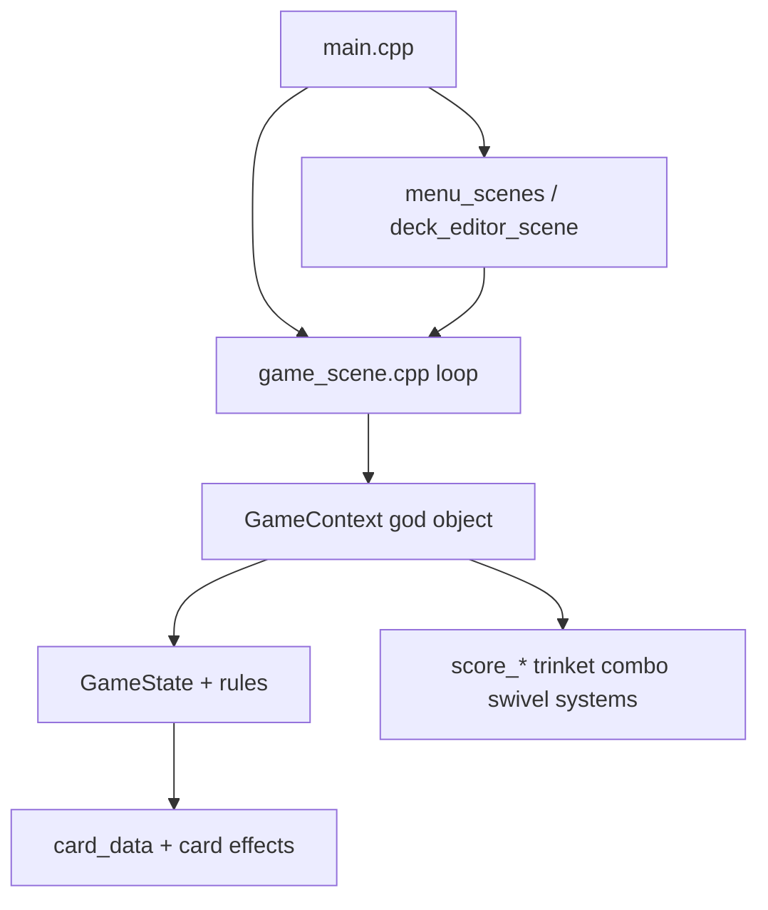
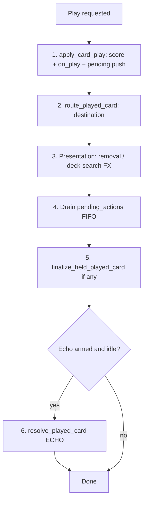

# Biggest Number — Project Handoff

**Last updated:** 2026-08-31  
**Purpose:** Single document to onboard a new machine / Cursor session and continue development without prior chat history.

> **Windows tree note (2026-09-01):** **Primary product direction:** RPG overworld MVP — see [`docs/RPG_OVERWORLD_MVP_PLAN.md`](RPG_OVERWORLD_MVP_PLAN.md). Roguelike run mode (`docs/ROGUELIKE_RUN_HANDOFF.md`) remains optional side content.

---

## 1. Project overview

**Biggest Number** is a GBA card game built with **[Butano](https://butano.readthedocs.io/en/latest/)** (C++). The player builds a deck, plays cards for score and multipliers, uses trinkets (Echo, Lucky 7, etc.), combos, and multi-frame pending-action UI (graveyard picks, scry, deck search).

**Future goal:** **Roguelike run mode** (see `docs/ROGUELIKE_RUN_HANDOFF.md`). Overworld RPG vertical slice is **scrapped**. Battle refactor remains useful for stability but is **not** a hard gate for run Phase A.

**Codebase size:** ~51 headers + sources under `include/` and `src/`, ~11,600 lines total.

### Build paths

| Environment | Path |
|-------------|------|
| Mac (primary repo) | `~/Desktop/bn` (or wherever cloned) |
| Windows (Butano build) | `C:/Users/Vigil/Desktop/butano-master/examples/biggestnumber` |

Butano may not be available in Cursor agent sandboxes — rebuild locally after changes.

### Workflow conventions

- **Do not git commit** unless explicitly asked.
- Minimize scope — focused diffs, match existing naming and style.
- Comments explain **why**, not what (especially VRAM, held cards, pending queue order).
- Butano patterns: `bn::vector<T,N>`, `bn::sprite_ptr`, no heap `new`/`delete`.

---

## 2. Related documentation

| Document | Role |
|----------|------|
| [`ROGUELIKE_RUN_HANDOFF.md`](ROGUELIKE_RUN_HANDOFF.md) | **Primary direction** — run mode, drops, upgrades, phases A–D |
| [`GAME_DESIGN_BRD.md`](GAME_DESIGN_BRD.md) | Living design doc — play costs, Echo, cards, §16 open questions |
| [`play_resolution_matrix.md`](play_resolution_matrix.md) | Play-resolution audit, routing tree, migration #2a–#2e, manual test checklist |
| [`SESSION_HANDOFF_LIFELINE.md`](SESSION_HANDOFF_LIFELINE.md) | Lifeline GY-ordering (fixed Approach B) |
| [`FEATURE_PLAN_2026-08.md`](FEATURE_PLAN_2026-08.md) | August 2026 roadmap — rarities, sticker paper, card reworks, new modes |
| **This file** | Session handoff, refactor status, next steps |
| `.cursor/plans/refactor_inventory.plan.md` | Full duplication audit, dependency graph (copy with repo or from other machine) |
| `.cursor/plans/rpg_overworld_vertical_slice_871a2829.plan.md` | Overworld slice plan (blocked on refactor) |

If `.cursor/plans/` is missing on a new machine, copy those two plan files from the other computer — they are not always in the git repo.

---

## 3. Strategic decisions (do not re-litigate)

1. **Refactor before overworld** — overworld Phase A/B blocked until refactor exit criteria pass.
2. **Documentation-first** for play resolution — matrix written before merging duplicate code paths.
3. **Unified Echo (BRD §9.1)** — no Swivel/Hacker/Pilot special cases. Second instance = **full play** via `PlaySource::ECHO` after first instance is **fully idle** (pending empty + presentation FX not blocking).
4. **Play cost model (BRD §5.3):**
   - **Clover** — held cost (`defer_graveyard_until_pending`); card held until pending queue drains.
   - **Big Kurosawa Burger** — early GY cost; burger to GY immediately → discard cost → cost card `on_discard` → ×4. **No defer** — intentional.
   - **Bones** — GY-entry trigger; `on_discard` counts GY **including itself** (`graveyard.size()` at discard time).
5. **Echo `cards_played_this_round`** — **both** first instance and echo replay increment (matrix §6.3). Echo still only procs **once per round**.
6. **Rename done:** Kirisawa → **Kurosawa** (`BIG_KUROSAWA_BURGER`, `effect_big_kurosawa_burger`, sprites `bigkurosawaburger_*` under `graphics/`).

---

## 4. Architecture snapshot



### Largest files (refactor hotspots)

| File | ~Lines | Role |
|------|-------:|------|
| `src/game_context.cpp` | 1657 | Pending actions, scoring UI, panels, FX, round end |
| `src/game_input.cpp` | 776 | `handle_input` megafunction + echo branches |
| `src/game_render.cpp` | 713 | `render_frame` megafunction |
| `src/card_data.cpp` | 677 | All card defs + effect fns + sprite table |
| `src/deck_editor_scene.cpp` | 570 | Deck builder UI |
| `src/combo_system.cpp` | 656 | Combo match + cinematic |

---

## 5. Refactor plan — status and order

### Execution order

```
#5 + #4 (DONE) → #2a (DONE) → #2b (DONE) → #2c (DONE) → #2d → #2e
→ #1 → #3a / #3b → #6 → (overworld)
```

Side branch anytime: **#4** (already done), **#7** deferred until RPG content surge.

### Completed work

| Step | Deliverable |
|------|-------------|
| **#5** | Merged `column_first_visible_index` / `row_first_visible_index` → `first_visible_index()` in `include/ui_common.h`, `src/ui_common.cpp` |
| **#4** | `SceneText`, `SelectorGlyph`, `DirectionRepeatState`, `poll_direction_repeat()` in `ui_common`; migrated `menu_scenes.cpp`, `deck_editor_scene.cpp`, `game_input.cpp` (`GameContext::poll_direction` delegates) |
| **#2a** | Full play-resolution matrix in `docs/play_resolution_matrix.md` |
| **#2b** | `include/play_resolution.h`, `src/play_resolution.cpp` — types + stub `resolve_played_card()` |
| **#2c** | `route_played_card()` implements §3 decision tree (**no call-site changes yet**) |
| **Bug fix** | Bones: `effect_bones_discard` uses `state.graveyard.size()` (includes self) in `src/card_data.cpp` |

### Immediate next step: **#2d-hand**

Migrate the **hand play path** in `src/game_input.cpp` to use `route_played_card()` instead of inline routing duplicated in `finish_played_card_from_hand()`.

**Hotspots:**
- Normal hand play + echo: ~L192–310
- Swivel follow-up from hand: ~L443–468
- Routing today: `finish_played_card_from_hand()` in `src/game_helpers.cpp`

**After migration, run manual test matrix rows 1–5, 9, 11** (see §8).

### Remaining refactor steps

| Step | Deliverable | Notes |
|------|-------------|-------|
| **#2d-hand** | Hand path uses unified router | One PR |
| **#2d-scry** | Replace `scry_play_selected` body | Rows 7, 12 |
| **#2d-search** | Replace `deck_search_play_selected_type` | Row 8 |
| **#2d-echo** | Single echo queue; delete legacy flags (§7) | Rows 3–6 |
| **#2e** | Remove dead `evaluate_card`, `play_card_type` | Grep zero callers first |
| **#1** | Pending dispatch table vs 291-line `begin_next_pending_or_finish` | `game_context.cpp` |
| **#3a** | Split `handle_input` by `GameMode` | Gameplay-critical |
| **#3b** | Split `render_frame` by `GameMode` | Visual regression |
| **#6** | Thin `game_state.h` — combo types out of include graph | After #1–#3 settle |
| **#7** | Split `card_data.cpp` | Defer until RPG card surge |

**Do not** merge hand + scry + echo in one PR. **Do not** interleave #1 and #3 in the same PR.

### Refactor exit criteria (required before overworld)

| Step | Why overworld needs it |
|------|------------------------|
| **#5** Visible-index merge | Shared scroll math for dialogue / menus |
| **#2** Full `resolve_played_card` | Battle return must not duplicate play paths |
| **#1** Pending dispatch | Return-from-battle may resume pending effects |
| **#3a** Input split | `handle_input` too large to extend safely |
| **#3b** Render split | Clear VRAM ownership on scene handoff |
| **#6** Thin `game_state.h` | Overworld headers must not pull combo cinematics |

**Recommended (not hard gate):** #4 SceneText — done; dialogue reuses it.

**Deferred past overworld slice:** #7 `card_data` split.

**Smoke test before overworld:**
- Menu → full battle run → run complete, no regressions
- VRAM stable on scene exit
- All 12 play-resolution matrix scenarios green on emulator

### Honest progress assessment (as of handoff)

- **~25% through refactor steps**, **~10–15% by impact** on battle hotspots.
- Menu/editor dedup (#4, #5) and play-resolution spec (#2a–#2c) are real wins.
- **Megafunctions and duplicate play paths are largely unchanged** until #2d lands.
- First **large** payoff: **#2c → #2d** (unified routing + echo simplification).

---

## 6. Play resolution — API and routing

### Files

- `include/play_resolution.h`
- `src/play_resolution.cpp`

### Types

```cpp
enum class PlaySource : uint8_t
{
    HAND,         // Normal hand play; removes card from hand index
    SCRY,         // Pilot / Librarian peek buffer
    DECK_SEARCH,  // Hacker deck search pick
    ECHO,         // Echo replay; no hand removal
};

enum class PostPlayDestination : uint8_t
{
    NONE,        // Already handled (exile from hand, or animation owns routing)
    GRAVEYARD,   // graveyard_push + on_discard
    EXILE,       // Removed from hand; never GY (Necromancy)
    HELD_DEFER,  // held_played_card until pending queue drains
    DECK_TOP,    // Swivel follow — animation routes to deck top
};

struct PlayResolutionResult
{
    PostPlayDestination dest = PostPlayDestination::GRAVEYARD;
    bool increment_cards_played = true;  // both instances per §6.3
};

struct PlayResolutionContext
{
    PlaySource source = PlaySource::HAND;
    int hand_index = -1;   // Valid when source == HAND
};

PostPlayDestination route_played_card(const GameState& state, CardType type, PlaySource source);
PlayResolutionResult resolve_played_card(GameState& state, CardType type, const PlayResolutionContext& context);
```

### `route_played_card()` — decision tree (implemented #2c)

Call **after** `apply_card_play`. First match wins:

| Condition | Destination |
|-----------|-------------|
| `exiles_self_on_play` + `PlaySource::HAND` | `EXILE` |
| `exiles_self_on_play` + other source | `NONE` |
| `state.swivel_waiting` | `DECK_TOP` |
| `defer_graveyard_until_pending` && `!pending_actions.empty()` | `HELD_DEFER` |
| Default | `GRAVEYARD` |

**Cards with `defer_graveyard_until_pending`:** Clover, Jacks, Fishing Pole, Cups, Seeds.  
**Cards with `exiles_self_on_play`:** Necromancy only.

`resolve_played_card()` is still a **stub** — calls router only; does **not** call `apply_card_play` yet. Full pipeline lands in #2d.

### Target resolution pipeline (all sources)



**Echo idle gate (target):** `pending_actions.empty()` AND NOT `presentation_fx_blocking()` AND NOT deck search resolve active AND NOT `removing_card` AND NOT combo cinematic blocking AND swivel follow chain complete.

### Order-of-operations invariants (must preserve)

1. `apply_card_play` always runs first.
2. `defer_graveyard_until_pending` checks `!pending_actions.empty()` **at routing time**.
3. `exiles_self_on_play` wins over defer.
4. Discard effects fire on `graveyard_push`, not on exile or held.
5. Echo + pending (e.g. Echo Pilot): first play completes fully; echo queues full second play via `PlaySource::ECHO`.
6. Big Kurosawa Burger: burger in GY → discard cost → cost `on_discard` → ×4.

---

## 7. Duplicate code still in tree (migration targets)

| Path | Location |
|------|----------|
| Hand play + echo branches | `src/game_input.cpp` ~L192–310, ~L443–468 |
| Hand routing | `src/game_helpers.cpp` `finish_played_card_from_hand` |
| Scry play | `src/game_helpers.cpp` `scry_play_selected` |
| Deck search play | `src/game_helpers.cpp` `deck_search_play_selected_type` |
| Held card finalize | `src/game_events.cpp` `finalize_held_played_card` |
| Echo pending replay | `src/game_context.cpp` `begin_next_pending_or_finish` ~L1503 |
| Echo swivel | `src/swivel_system.cpp` `swivel_complete_follow` |
| Echo hacker FX | `src/game_context.cpp` `tick_deck_search_resolve` |
| Dead code (no callers) | `play_card_type`, `evaluate_card` in `game_helpers.cpp` |

### Legacy Echo flags to delete in #2d-echo

Do **not** preserve as special cases in the unified resolver:

- `echo_replay_second_pass` (`game_input.cpp`, `game_render.cpp`)
- `echo_pending_replay`, `echo_replay_card` (`GameState` / `game_context.cpp`)
- `echo_swivel_pending` (`GameState`, `swivel_system.cpp`)
- `echo_hacker_follows`, `echo_hacker_visual_pending`, `ECHO_HACKER` phase (`game_context.cpp`)

**Target:** one idle gate → `resolve_played_card(type, PlaySource::ECHO)` full play.

### Other critical duplication (post-#2)

| Duplication | Locations |
|-------------|-----------|
| Pending setup blocks | `game_context.cpp` `begin_next_pending_or_finish` (~291 lines) |
| Combo window matching | `combo_system.cpp` |
| Graveyard TARGET confirm branches | `game_input.cpp` ~L558–610 |

---

## 8. Manual test matrix (required per #2d PR)

Run on emulator before merging each migration PR.

| # | Setup | Action | Assert |
|---|-------|--------|--------|
| 1 | Hand: Clover + 3+ GY cards | Play Clover | Exile pick UI before Clover in GY; ×3 after 3 picks |
| 2 | Hand: Clover + &lt;3 GY | Play Clover | No pending; Clover to GY; no multiply |
| 3 | Echo + Pilot from hand | Play Pilot | Scry first; Pilot in GY; echo replays full Pilot after idle |
| 4 | Echo + simple +N card | Play | Two score applications; echo consumed |
| 5 | Echo + Swivel | Play | Deck-top routing; echo after swivel follow |
| 6 | Echo + Hacker via deck search | Play Hacker from search | Search anim → pending → echo chain |
| 7 | Scry: Miracle as rightmost/top card | Confirm play | +10 miracle bonus, not normal play |
| 8 | Deck search: Miracle at cursor 0 | Play | +10 miracle bonus |
| 9 | Necromancy from hand | Play | Exiled, not in GY |
| 10 | Bones as burger cost | Discard with cards in GY | +N where N = GY size including Bones |
| 11 | Swivel waiting + card from hand | Play | TO_DECK_TOP, not GY |
| 12 | Echo equipped; first play-effect from scry | Play from scry | Echo fires after scry play fully idle (target) |

**Per-PR minimum:**

| PR | Rows |
|----|------|
| #2d-hand | 1–5, 9, 11 |
| #2d-scry | 7, 12 |
| #2d-search | 8 |
| #2d-echo | 3–6 |

---

## 9. RPG overworld plan (future — do not start yet)

Blocked until §5 exit criteria pass.

### Phase A — movement slice

- `overworld_scene`: tilemap, 24×32 player sprite, 8-dir movement (4 frames + H-flip), collision
- Campaign entry in `main.cpp` (boot into overworld; menu still accessible or Play flow replaced)

### Phase B — one NPC battle handoff

- One static NPC + interaction zone (A to talk when adjacent/facing)
- `dialogue_system`: text box, pages, choice menu with **Play** / **Goodbye**
- **Play** → `run_game_scene` with saved deck → return to overworld (preserve map + player position)

### Deferred past vertical slice

- Loot scene (1–3 card drops, rarity labels)
- Save data v4 (NPC records, collection flags, unique drops)
- Data-driven `NpcDef` (deck, objective, drop table)
- Starter decks for new game selection
- Battle objectives / `BattleConfig`

### Why overworld waits on refactor

Landing new scenes on 1657-line `game_context.cpp` and ~776-line `handle_input` guarantees merge pain and duplicated play/pending paths. Dialogue lists need #5 scroll math; battle handoff needs #2 unified play resolution and #3 clear scene ownership.

---

## 10. Open design questions (BRD §16 — not blocking #2d-hand)

- Clover fizzle with &lt;3 GY — unplayable gate vs fizzle
- Seeds GY minimum
- Shoot combo text vs order-independent RPS
- Journal wording
- Roundup total vs round score
- Birds threshold reset
- See [`GAME_DESIGN_BRD.md`](GAME_DESIGN_BRD.md) §16 for full list

---

## 11. Coding notes for contributors

### When to comment

| Topic | Why |
|-------|-----|
| `release_card_display_tiles` before `set_type` | VRAM tile budget |
| `held_played_card` / `defer_graveyard_until_pending` | Card must not hit GY until pending UI finishes |
| `CARD_DISPLAY_PLACEHOLDER` (Sips) | Pooled display cards keep one tile set loaded |
| `pending_actions` + `begin_next_pending_or_finish` | Multi-frame effects; order vs combos |
| `bn::vector<T, N>` capacities | GBA has no heap growth |

### Adding a card

See comment in `include/card_type.h` — enum + matching row order in `card_data.cpp` + sprites via `tools/convert_sprites.py`.

### Suggested future layout (not implemented)

```
src/
  battle/     game_scene, game_context, game_input, game_render, game_helpers
  rules/      game_state, deck, scoring, card, card_data
  systems/    combo, trinket, score_*, swivel
  ui/         hud, game_ui, ui_common, ui_inspect
  scenes/     menu, deck_editor, (future overworld)
```

---

## 12. Cursor session bootstrap prompt

**Primary direction (2026-08-12):** Roguelike run mode — overworld scrapped. Bootstrap: **`docs/ROGUELIKE_RUN_HANDOFF.md` §1**.

### Refactor bootstrap (secondary — only if asked)

Battle refactor context only. This Windows tree may already have #2d/#1/#3 wired — re-audit `src/` before assuming #2d-hand is next. Do not start overworld work or commit without being asked.

---

## 13. Handoff changelog

| Date | Change |
|------|--------|
| 2026-08-11 | Initial handoff document created |
| 2026-08-12 | Primary direction → roguelike run; overworld scrapped; link `ROGUELIKE_RUN_HANDOFF.md` |
