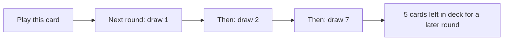

# Draw-economy cards for longer runs

Share copy of the Cursor plan **Long-turn draw cards** (2026-08-27).

Original Cursor plan file (this machine):

`/Users/garretthartley/.cursor/plans/long-turn_draw_cards_027f2eb3.plan.md`

This is a design plan, not implemented yet. Locked: **7 Feet Deep** (1/2/7 opening draws, GY fill), **Dead Rising** (rename Keep Going). Open: rarity for 7 Feet Deep, wheel trinkets.

---

**Overview:** 1/2/7 is locked. Extra turns already happen at 2+ cards left. GY fill is in: missing opening cards are random graveyard cards (Keep Going movie: GY to deck, then deal).

**Todos**

- Keep 1/2/7 as the lead card; treat flat -2 and 0/0/10 as rejected — **done**
- GY fill locked — random graveyard cards, GY to deck then deal, inspect text below — **done**
- Names locked: 7 Feet Deep (new card), Dead Rising (Keep Going rename). Still need rarity for 7 Feet Deep — **pending**
- Pick a wheel-breathing trinket (Odometer stamp vs optional digit picker vs another family). Staircase already exists for ascending +N — **pending**
- When implementing, play it in a Turtle + Time is Too Expensive + Dead Rising deck; only then consider the draw-1-for-3-rounds sibling — **pending**

---

The diagnosis is right. A round ends when the hand is empty, the opening deal is hardcoded to 5, and the deck caps at 25. A clean run is about **5 rounds**. Extra draws (Wishes, Catnip, Straw, Cycle) make it *shorter*. The long-run cluster — Turtle Mode, Time is Too Expensive, Sips, Snail Mail, Keep Going — all want more rounds, but none of them slow the faucet. Keep Going puts cards *back*; this idea spends them slower.

`draw_at_start` already exists on future-round seeds and is unused (Snail Mail shipped as +5/+5/×5, not extra draws). That is a later implementation detail, not the design.

## Why flat −2 for 3 rounds feels bad

Three rounds of 3 cards is 9 vs 15: same “save 6 cards, get another round later,” but every round in the window is a slightly worse version of a normal turn. No spike, no skip. It reads as the game getting slower, not as a plan.

## Why 1 / 2 / 7 works

Over the next 3 rounds, draw **1, then 2, then 7** (10 cards instead of 15). Net −5 cards, which is about one extra later round, with a rhythm:

- **Draw 1:** a fast hit. Time is Too Expensive, Solo, or a Miracle auto-play are complete turns. Burger / Jacks / Fishing Pole fizzle (no discard partner). Wishes explodes the famine on purpose.
- **Draw 2:** the smallest sequence that still feels like play. Burger can pay its cost. PB+Jelly can complete. Still over in seconds.
- **Draw 7:** the reason you took the card. Journal (× cards played), Overclock (discard-for-multipliers), combos, and “real hand” cards finally have a table.

Two cheap rounds, one superpowered round, and five cards banked for later. That is the opposite of a chore: you skip the boring middle of three 5-card rounds and keep the dump.



## Pressure test

**Late play used to be written as a skill check. That is now a problem to solve**, not a feature. See “Extra turns vs completing the 7” below.

**Turtle Mode is the dream pairing.** Turtle already holds score across 3 sub-rounds. Seed 1/2/7 into that window and you get a 10-card scoring turn that *feels* like two setups and a dump, instead of 15 plays of attention.

**Keep Going / Dead Rising becomes a tutor.** Keep Going already puts a random GY card on top at the start of the next 3 rounds, then you still draw 5. On a draw-1 round, that GY card *is* the turn. Strong, readable synergy.

Keep Going does **not** only extend the game under 15 cards. It adds 3 GY cards over 3 round starts. An extra round happens when those 3 cards cross a multiple of 5: 20→23 is +1 round, 16→19 is not. Unreliable in both directions. 7 Feet Deep should be the reliable extra-round splitter (at 2+ cards left).

**Time is Too Expensive** loves the extra later round *and* is a perfect 1-card famine play (`+2 × current round` and done).

**Stacking.** Today future seeds accumulate. Two copies: −4/−4 and −3/−3 want a **floor of 1** so you never open a round with 0 cards (empty hand → round instantly ends, which will feel like a skip bug). The feast would stack to draw 9. If this is a Turtle-style rare singleton, stacking does not matter.

**Miracle on a draw-1 round.** Opening deal currently fills *until the hand has 5*, and Miracle auto-plays out of the hand. For this card, opening deal has to mean “attempt N draws,” not “until hand size is N,” or a leading Miracle would keep dealing. Design rule: **N draw attempts**, Miracle still auto-plays as the first of those.

**Flood / Torrent** (in `docs/CARD_REFERENCE.md`, not in the enum yet) would go nuts on the 7 and look sad on the 1. Fine if they ever ship; they are not a reason to change the pattern.

## Alternatives (same lever, different rhythm)

- **Flat −2 × 3** (draw 3/3/3): same economy, no spike. Rejected.
- **1 / 1 / 8:** snappier famine, 2-card sequences never happen, Burger cannot pay on either setup round. Worse than 1/2/7.
- **0 / 0 / 10:** two skipped rounds. Time is Too Expensive loves a free round increment; it will feel like the game stuttered. Floor-at-1 exists to avoid this.
- **1 / 9 over 2 rounds:** simpler text, saves only 0–2 cards depending on numbers, less “long run.” Better as a *different* card than as a replacement.
- **Permanent “draw 3 instead of 5”:** deck-defining, no feast. A different fantasy (always-on grind), not this card.

**1 / 2 / 7 is the one to keep.** Absolute text (“draw 1, then 2, then 7 instead of 5”) is clearer than deltas (“4 fewer, 3 fewer, then 7”).

---

## Extra turns vs completing the 7

The original worry was “need 10 cards left or you don’t bank a turn.” That was the wrong picture. Splitting the remainder already adds rounds whenever **2+ cards** are still in the deck:

- **8 left:** 1+2+5 vs 5+3 → 3 rounds instead of 2
- **3 left:** 1 then 2 vs one 3-card round → 2 instead of 1 (feast skipped; game over after the 2)
- **1 left:** 1 vs 1 → no extra turn
- **Played as the last card of the last round:** seeds never fire

So the extra-turn goal is already met for almost every play. What late play still fails is the **fantasy**: the 7 is “whatever is left,” or it never happens.

GY fill is no longer load-bearing for extra turns. It is only “the 7 is always a 7.”

### Is GY fill confusing?

**As card text, yes.** “Draw 1, then 2, then 7 instead of 5” is already a delayed 3-round effect. Adding “if the deck is short, the rest come from your graveyard” is a rider the player will not still be holding two rounds later. This game already does not rely on memory for delayed effects: the HUD shows Sips / Snail Mail / Keep Going on the next-3-round line (`draw N`, `keep`). A long rider on the card will not teach the fill.

**As a silent opening deal, also yes.** If the deck HUD says 3 remaining, then 7 cards grow out of the deck sprite, it will feel like a bug. Mixed origin in one deal (5 from deck, 2 from GY flying into the hand) is the same problem: the opening deal has always meant “from the deck.”

**As a Keep Going movie, no.** Keep Going already, at round start, flies GY cards onto the deck one-by-one, *then* deals the opening hand from the deck. If this card is short N cards, do that same transfer N times, then deal. The player sees the graveyard move, the deck count go up, then a normal `draw 7`. They do not have to remember the rider. Inspect text can mention it; the HUD can stay `draw 7`.

That is the only version that is not confusing, because it is a movie the player already knows.

### What GY fill is worth now

If we steal Keep Going’s visual, GY fill is readable. The remaining costs are:

- Identity overlap with Keep Going / Dead Rising (both GY→deck at round start)
- Very late play can force a full extra 7-from-GY round if we also fill when the deck is empty (more than +1)
- Card inspect text gets a clause even if the HUD stays simple

If we skip GY fill, the card text stays one sentence, extra turns still happen at 2+, and a short feast is obvious (deck hits 0). The only holes left are 0–1 cards left and an incomplete 7.

**Locked:** GY fill is in. Missing opening cards are random graveyard cards. Visual is Keep Going’s movie (GY→deck, then deal), never silent extra draws from the deck sprite. Empty GY just deals short; do not mention that on the card (Cups-style skip is obvious).

---

## Card 1 — 7 Feet Deep

**Working name:** *7 Feet Deep* (or *Seven Feet Deep*). Locked as the lead unless a better burial-depth pun wins.

**Effect:** No immediate score. Seed the next 3 rounds: draw **1**, then **2**, then **7** instead of 5. If a round’s opening deal is short, put random graveyard cards on top of the deck until the count is met, then deal (Keep Going’s transfer). Empty GY deals short.

**Inspect text** (wraps at 19 chars; numbers sit on their own line):

`Next 3 rounds, draw 1, then 2, then 7 instead of 5. Missing cards come from the graveyard at random.`

```
Next 3 rounds, draw
1, then 2, then 7
instead of 5.
Missing cards come
from the graveyard
at random.
```

Why this shape: first sentence is the card; second is the rider. “Instead of 5” stops people reading these as extra draws on top of 5 (Snail Mail’s HUD `draw 1` means extra). “Missing cards” points at 1/2/7 without Magic-ese (“if you would draw”) or design jargon (“remainder”). “At random” matches Keep Going’s “a random card from your graveyard.” Do not explain GY→deck on the card; the transfer teaches itself.

**Identity:** 0 on play, like Turtle Mode, Keep Going, Sips. The card *is* the economy.

**Rarity instinct:** Rare singleton if the 1/2/7 shape should stay pure; Uncommon (2–3 copies) if chaining a second copy off the feast turn is a feature (another 1/2/7 after the 7). Lean **Rare 1** first; stacking can wait for playtest.

**What it does not do:** no +N, no multiplier on the feast. The 7-card hand is the reward. Putting ×5 on round 3 (Snail Mail’s job) would steal Snail Mail’s identity and overpay.

---

## Flavor: grave idioms (Roll Over’s family)

Roll Over works because the saying is the mechanic: they are rolling over in their grave, so GY cards get up and play. Same job here — the name should be the 1/2/7, not a sticker on top of it.

Occupied already: Tombstones, Bones, Necromancy, Lifeline, Comeback, Encore, Get Me Outa Here, Rags to Riches.

### 7 Feet Deep (this card)

Burial is “six feet under.” One extra foot is the joke, and **7** is the feast. The two famine rounds are one foot in, then two feet in; round three you are seven feet deep and everything comes up anyway (including from the GY). That irony is the Roll Over trick: you buried them deeper and they still do not stay down.

Close variants if the numeral feels off on a card: *Seven Feet Deep*, *Seven Feet Under* (closer swap on the frozen idiom), *Seven Deep*. *Six Feet Under* is the famous phrase and the wrong number — do not use it.

Other burial-depth / digging sayings that almost work, but worse:

- **One Foot in the Grave** — names the famine 1, buries the 7
- **Dirt Nap** — funny, no 1/2/7
- **Deep Cut / Deep Cuts** — GY as back catalog, “deep,” music-y; does not say 7
- **Dig Deep** — motivational poster, not a grave pun
- **Saved by the Bell** — folk tale of the coffin bell for the buried-alive; better for a different card
- **Dead Ringer** — same folk tale family (lookalike / coffin bell); mechanic is not a copy

### Dead Rising (today: Keep Going)

Rename **Keep Going** → **Dead Rising**. GY → deck top, three times; this card exiles itself. The dead climb onto the deck.

HUD today prints `keep` / `keep 2` on the next-3-round line. On implement, shorten to something like `rise` / `rise 2` so it still fits the mod column.

(Capcom’s *Dead Rising* is a zombie game with the same title. The phrase still reads as “the dead are rising,” which is the mechanic. Flagged, not a blocker unless you want to dodge it.)

### Other grave sayings (bank for later cards, not these two)

Whistle past the graveyard; take it to the grave; over my dead body; pushing up daisies; dance on someone’s grave; from the cradle to the grave; dead and buried; last nail in the coffin; kick the bucket; give up the ghost; dead to the world; dead in the water; beat a dead horse; wouldn’t be caught dead; dead last; wake; ashes to ashes. Most of these want a different mechanic (discard, exile, last-card, mill).

---

## Card 2 — the tutor famine (optional sibling)

Only worth printing if you want Dead Rising / GY-return to have a dedicated enabler, not as a substitute for Card 1.

**Effect:** Next 3 rounds, draw **1** instead of 5. No feast.

**Why it exists:** maximum extra rounds (9 cards vs 15, and three 1-card turns). Dead Rising, Fishing Pole, Swivel, Birds of a Feather all become “I play the exact card I put on top.” Time is Too Expensive is the whole turn three times.

**Why it might not exist:** three anemic turns is exactly the feeling you already rejected — unless the rest of the deck is built to make a 1-card turn interesting. That is a narrower, meaner rare. Play Card 1 first; only add this if 1/2/7 still does not stretch the run enough.

---

## Taste calls (when you want to implement)

- GY fill: locked. Random GY cards, GY→deck then deal. Inspect text as above.
- Dead Rising: Keep Going rename is locked. HUD label `keep` → something like `rise`.
- Floor at 1 when anything else also reduces opening draw.
- HUD should show the **resulting** opening size (`draw 1`), not `draw -4`.
- Do not start Card 2 until Card 1 has been played in a Turtle + TITE + Dead Rising deck.

---

## Wheel trinkets (vanilla +N)

Wheels stay as the starter base (campaign starter is Longboard, Heelys, Scooter, Skateboard, Toppings). The argument against them is they are just +N. Staircase already tries to fix that for **all** +N cards, not just transports: play strictly ascending +N, then add (sum × length). A new trinket should either be **wheel-tribe specific** (Longboard…Bike) or a different lever than climbing.

Get With The Times already blanks every card add. Do not reprint that for wheels only.

### The digit-replace idea

“Whenever you play a wheel, instead of adding, replace a digit in round or total with N.”

Problems:

- **The Fifth / Swap / The Fourth** already are digit surgery. Every wheel becomes another Fifth with a variable digit. Heavy overlap.
- **Picker every wheel is a chore.** Wheels are fast on purpose. Swap-style “round or total, which digit” on Longboard is the opposite of 7 Feet Deep’s “this turn should be easy.”
- **+Digit upgrades** concatenate onto +N, so Longboard can be +17. “Replace a digit with 17” does not parse. Would have to use ones place only.
- **Toppings** is a starter wheel and is not +N.

Keep the fantasy (wheels write their number onto the score). Drop the picker.

**Odometer (recommended version of this idea):** When you play a +N wheel (1–9), do not add. The ones digit of round score becomes N. No picker. Bike stamps a 9, Stoller stamps a 7 (Lucky 7), Heelys stamps a 2. Fast like a wheel. Skill is order, Lucky 7, Palindrome, Dilla (0 is hard — no 0-wheel), Swap. Two-digit upgraded wheels use ones place only.

Optional softening: still add, *and* stamp the ones digit (wheels stay wheels, plus a writing kit). Stronger; Morel still ticks.

### Other trinkets that make wheels worth keeping

- **Training Wheels** — The first wheel you play each round goes to the top of the deck instead of the GY (Swivel, once per round, wheels only). They stay in the run. Pairs with 7 Feet Deep / long games.
- **Kickflip** — Wheels gain Cycle: Down to exile and draw 1 (or always draw 1 on play). Turns +N into cantrips. Deck-thinner, so it fights the long-turn goal unless the draw is optional.
- **Carpool** — When you play a wheel, play a random other wheel from the GY (Roll Over, transport-only). Set-collection in the GY becomes a dump. Can explode with Echo.
- **Full Rack** — When you play a wheel, add the number of unique wheel names in the GY (Tombstones, but only the transport set). Rewards keeping the whole 1–9 line.
- **Matching Number** — If the ones digit of round score already equals this wheel’s N, ×N (or +10) instead of +N. Hit the number, then slam the matching wheel. Skill, no picker.
- **Spare Tire** — The first time each battle a wheel would be the last card in your hand, draw 1 (Solo, wheels only).
- **Odometer (persistent)** — Each wheel adds N to a running trip counter. At 10 / 100 / 1000, Roundup-style bump. Different from ones-stamp; more like a slow extra Roundup that only wheels feed.

Do not do Staircase 2 (another ascending-combo). Do not do Get With The Times 2 (blank adds, consolation prize).
