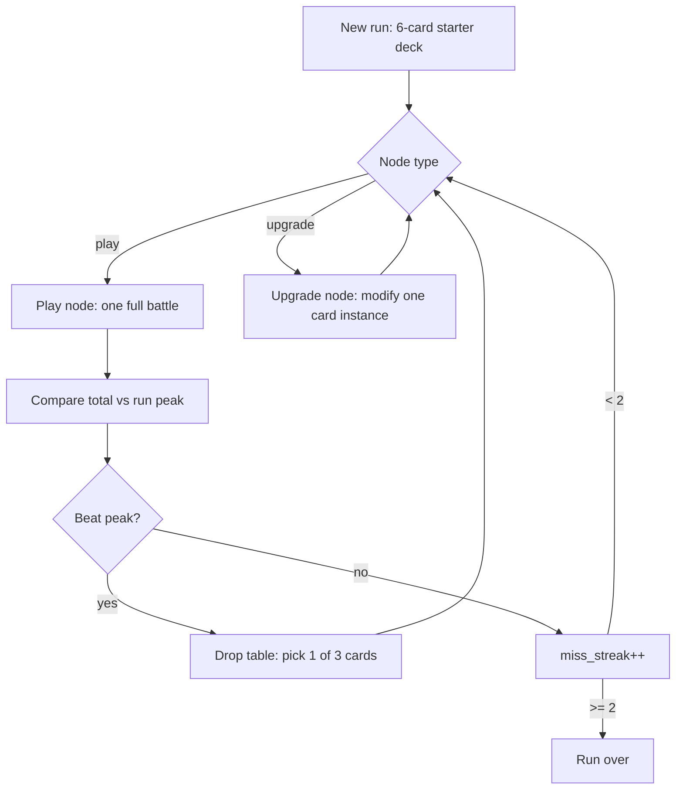

# Roguelike Run Mode — Design & Architecture Handoff

**Created:** 2026-08-12  
**Status:** Planning — overworld vertical slice **scrapped** for this direction.  
**Purpose:** Shareable spec + Cursor bootstrap prompt for implementation on another machine/session.

**Related docs:** `docs/HANDOFF.md` (refactor status), `docs/GAME_DESIGN_BRD.md` (current battle rules), `docs/SESSION_HANDOFF_LIFELINE.md` (separate Lifeline bug fix).

---

## 1. Bootstrap prompt (copy to other Cursor session)

```
You are continuing **Biggest Number** (Butano GBA C++). Read these in order:
1. `docs/ROGUELIKE_RUN_HANDOFF.md` (full spec; §6 = finalized rarity / max-copies table)
2. `docs/HANDOFF.md` (refactor context only — overworld is SCRAPPED)

## Situation
New machine, no chat history. Direction is **roguelike run mode**, not overworld RPG.

## Before coding
- Confirm you've read the handoff docs
- Summarize §10 implementation phases (A→D)
- Ask which phase Garrett wants unless he already specified
- Do NOT git commit unless explicitly asked

## Start with Phase A unless directed otherwise
Run skeleton only: RunState, New Run menu entry, play → drop → repeat, run ends on miss_streak >= 2. No upgrades, no instances yet.

## Do NOT start
- Overworld / NPC campaign work
- Phase C/D (instances, Lead/Yeast) until A+B are working
- Lifeline bug fix unless Garrett asks (see `docs/SESSION_HANDOFF_LIFELINE.md`)

## Separate context
Play-resolution refactor #2b/#2c done; #2d-hand not wired. Helpful for battle bugs but not a gate for Phase A.

## Key design rules (summary)
- Run starts with a **6-card** starter: **5 unique** vanilla +N transport cards + **Big Kurosawa Burger**. Grow via drop picks after play nodes.
- **Run peak** = best total score this run. Run ends after **2 consecutive play nodes** without beating run peak.
- **Play node** = existing battle (`run_game_scene`). **Upgrade node** = Lead/Yeast or +digit/×2 on a specific card instance.
- **Drop table:** baseline rarity slots from run peak band, **merged** with delta tier (take better per slot). See §4.
- **Card instances** required for upgrades (not just CardType). Lead/Yeast via centralized `zone_ops` + `apply_gravity()` — NOT scattered conditionals.
- GBA memory: instance pool ~50 entries is fine; sprite/VRAM budget unchanged.

## Current codebase reality
- Today: menu → pick saved deck → ONE battle → deck high score in save v3. No run state, no rarity, no per-card modifiers.
- Battle core is reusable. Architecture change needed for instances + zone ops before full upgrades.

## Files to sync
Whole `bn` repo, or at minimum §12 of this document.
```

---


## 2. Situation


| Before                                                           | Now                                                            |
| ---------------------------------------------------------------- | -------------------------------------------------------------- |
| Cursor on original Mac; chats covered refactor, Lifeline, design | **New machine / new Cursor session**                           |
| Planned RPG overworld after refactor                             | **Overworld scrapped** — roguelike run is the progression mode |
| Deck editor + saved decks + per-deck high score                  | Run mode: temporary deck, run peak, drops, upgrades            |


Sync the **whole** `bn` **repo** (git push/pull). This file lives in `docs/ROGUELIKE_RUN_HANDOFF.md`.

---


## 3. Roguelike run — player flow




### Run rules


| Rule               | Detail                                                                           |
| ------------------ | -------------------------------------------------------------------------------- |
| **Starter**        | **6 cards:** 5 unique draws (without replacement) from vanilla **+N transport** pool + **Big Kurosawa Burger** (always). Pool = Longboard…Bike (`LONGBOARD`…`BIKE`). |
| **Play node**      | Run one battle to completion (deck empty / current `run_finished` logic)         |
| **Run peak**       | Best **total score** achieved **this run** (not saved-deck high score)           |
| **Improvement**    | This fight’s total **>** run peak before fight → peak updates, `miss_streak = 0` |
| **No improvement** | Total ≤ peak → `miss_streak++`                                                   |
| **Run end**        | `miss_streak >= 2` (two consecutive play nodes without new peak)                 |
| **Between fights** | Add **one card** from drop table (when player picks from 3 offers)               |
| **Upgrade node**   | Separate from play; **either** apply one upgrade to one card **or** remove one card from the run deck |
| **Trinket node**   | Every **5 battles**: offer **2** random unequipped trinkets; pick 1 to equip (fill empty slot or replace) |


### Node map (v1 suggestion)

Start **linear** — no branching map until core loop works:

`Play → Drop (on new peak) → Upgrade → Play → …`

Later: insert **Trinket** nodes on the same linear track (after upgrades ship).

---


## 4. Drop table (merged baseline + delta)

Three card offers per play node (player picks **one** to add to run deck).

### 4.1 Score delta

```
delta = battle_total_score - run_peak_before_this_fight
```

(Use peak **before** the fight starts, not after updating.)

### 4.2 Baseline slots (from run peak **before** this fight)


| Run peak            | Baseline offer mix (3 slots)                            |
| ------------------- | ------------------------------------------------------- |
| **< 100**           | No baseline — slots determined **only** by delta (§4.3) |
| **100 – 249**       | **2 common + 1 uncommon**                               |
| **≥ 250**           | **1 common + 1 uncommon + 1 rare**                      |


Baseline is the **floor** when peak is high — not a cap on better drops.

### 4.3 Delta tier (improvement this fight)


| Delta      | Tier mix (3 slots)             |
| ---------- | ------------------------------ |
| **< 30**   | 3 common                       |
| **≥ 30**   | 2 common + 1 uncommon          |
| **≥ 100**  | 1 common + 1 uncommon + 1 rare |


### 4.4 Merge rule **[CONFIRMED]**

For each of the **3 slots**, slot rarity = **max(baseline slot rarity, delta tier slot rarity)**.

Rarity order: Common < Uncommon < Rare.

**Examples**


| Run peak | Delta  | Baseline | Delta tier | **Merged offers** |
| -------- | ------ | -------- | ---------- | ----------------- |
| 150      | +20    | C, C, U  | C, C, C    | **C, C, U**       |
| 150      | +120   | C, C, U  | C, U, R    | **C, U, R**       |
| 300      | +10    | C, U, R  | C, C, C    | **C, U, R**       |
| 50       | +80    | (none)   | C, C, U    | **C, C, U**       |


### 4.5 Pick generation (implementation notes)

1. Compute merged slot rarities (3 slots).
2. For each slot, roll a **card offer** from run deck pool rules (rarity, copy limits, not already 3 copies if capped).
3. UI: show 3 cards; player picks one → append **new instance** to run deck (respect max copies / singletons).

**Not implemented today:** rarity enum, copy limits, weighted tables, reward scene.

---


## 5. Upgrade system

Per upgrade node the player picks **one** branch: **Remove a card**, **Lead/Yeast**, or **+Number/×2** — then (for upgrades) a target card instance.

### 5.1 Lead vs Yeast (zone gravity)


| Upgrade           | Behavior                                                                                                                                      |
| ----------------- | --------------------------------------------------------------------------------------------------------------------------------------------- |
| **Lead** (heavy)  | Whenever this **instance** is in **deck or graveyard**, after any reorder/shuffle/swap/peek put-back, it **moves to the bottom** of that zone |
| **Yeast** (light) | Same zones — always **moves to the top** after those operations                                                                               |


- Applies **after** the causing effect finishes (shuffle, swap, scry reorder, etc.).
- **Regardless** of shuffle randomization or manual reorder — gravity pass runs afterward.
- Each card: **at most one** Lead **or** Yeast (define if mutually exclusive — assumed yes).


### 5.2 +Number vs Increment multiplier


| Upgrade            | Behavior                                                                                                                                                                                                                          |
| ------------------ | --------------------------------------------------------------------------------------------------------------------------------------------------------------------------------------------------------------------------------- |
| **+Number**        | Roll **1–9**; append digit to the **right** of an existing **+N** on the card (display + logic). Example: Scooter +3 + digit 7 → **+37** (concatenate, not add 7). **Any card** can receive this — Rock (0 today) becomes +1..+9. |
| **Increment mult** | If card has **no** base multiply, gains **×2** when played. Example: Rock gets ×2 on play. Cards that already have multiply — define edge case (likely ineligible for this upgrade).                                              |


### 5.3 Upgrade limits

- Each upgrade **type** at most **once per card instance**.
- Different cards can each have any applicable upgrades.
- Upgrades attach to **specific instances** (two Scooters can differ).


### 5.4 Upgrade UI flow

1. Choose branch: **Remove a card** OR **Lead/Yeast** OR **+Number/Increment**.
2. If Remove: pick target from run deck → card deleted → node done.
3. If upgrade: choose sub-option (Lead vs Yeast, or +Number vs Increment).
4. Pick target card from run deck (filter: eligible, not already has that upgrade).
5. For +Number on cards with multiple + values — show cards that **add** (or all cards per design).

### 5.5 Trinket choice node

After every **5** completed battles (while the run continues): roll **2** random trinkets from the catalog that are **not** currently equipped. Player picks one (B skips).

- If a `NONE` slot exists → equip there.
- Else → pick which equipped trinket to replace.

---


## 6. Card rarity evaluation (designer worksheet)

**Status:** **Finalized** in the summary table below — **Rarity** (`C` / `U` / `R`) and **Max copies** are the source of truth.  
**Next step for code:** copy into `CardMeta` / `card_data` for drop tables (§4).

### How to use this form

1. Edit **Rarity** and **Max copies** in the summary table (checkbox columns are optional / legacy).
2. Per-card blocks below are for notes only; sync from the table when they drift.
3. **Max copies `0`** = not offered on drop table.
4. **Rule:** one rarity per card — drop pools filter by rarity + copy cap.


### Quick summary table (source of truth)


| #   | Asset / enum                                    | Name                  | Effect (short)                        | Rarity | Common | Uncommon | Rare | Max copies |
| --- | ----------------------------------------------- | --------------------- | ------------------------------------- | ----- | ------ | -------- | ---- | ------------------ |
| 1   | `sips` / SIPS                                   | Sips                  | +2 next 3 rounds                      | U     | [ ]    | [x ]     | [ ]  | 5                  |
| 2   | `longboard` / LONGBOARD                         | Longboard             | +1 round                              | C     | [ x]   | [ ]      | [ ]  | 5                  |
| 3   | `heelys` / HEELYS                               | Heelys                | +2 round                              | C     | [ x]   | [ ]      | [ ]  | 5                  |
| 4   | `scooter` / SCOOTER                             | Scooter               | +3 round                              | C     | [ ]    | [ ]      | [ ]  | 5                  |
| 5   | `skateboard` / SKATEBOARD                       | Skateboard            | +4 round                              | C     | [ ]    | [ ]      | [ ]  | 5                  |
| 6   | `rollerblades` / ROLLER_BLADES                  | Roller Blades         | +5 round                              | C     | [ ]    | [ ]      | [ ]  | 5                  |
| 7   | `wagon` / WAGON                                 | Wagon                 | +6 round                              | C     | [ ]    | [ ]      | [ ]  | 5                  |
| 8   | `stoller` / STOLLER                             | Stoller               | +7 round                              | C     | [ ]    | [ ]      | [ ]  | 5                  |
| 9   | `ripstik` / RIP_STICK                           | Rip Stick             | +8 round                              | U     | [x ]   | [ ]      | [ ]  | 5                  |
| 10  | `bike` / BIKE                                   | Bike                  | +9 round                              | U     | [ x]   | [ ]      | [ ]  | 5                  |
| 11  | `clover` / CLOVER                               | Clover                | Exile 3 GY → ×3                       | R     | [ ]    | [ x]     | [ ]  | 5                  |
| 12  | `bigkurosawaburger` / BIG_KUROSAWA_BURGER       | Big Kurosawa Burger   | Discard → ×4                          | R     | [ ]    | [ x]     | [ ]  | 5                  |
| 13  | `rock` / ROCK                                   | Rock                  | RPS combo piece                       | C     | [ ]    | [ ]      | [ ]  | 1                  |
| 14  | `paper` / PAPER                                 | Paper                 | RPS combo piece                       | C     | [ ]    | [ ]      | [ ]  | 1                  |
| 15  | `scissors` / SCISSORS                           | Scissors              | RPS combo piece                       | C     | [ ]    | [ ]      | [ ]  | 1                  |
| 16  | `shoot` / SHOOT                                 | Shoot                 | RPS set → +100                        | R     | [ ]    | [ ]      | [ ]  | 1                  |
| 17  | `peanut_butter` / PEANUT_BUTTER                 | Peanut Butter         | PB&J combo piece                      | C     | [ ]    | [ ]      | [ ]  | 3                  |
| 18  | `jelly` / JELLY                                 | Jelly                 | PB&J combo piece                      | C     | [ ]    | [ ]      | [ ]  | 3                  |
| 19  | `straw` / STRAW                                 | Straw                 | S/S/B combo piece                     | C     | [ ]    | [ ]      | [ ]  | 3                  |
| 20  | `sticks` / STICKS                               | Sticks                | S/S/B combo piece                     | C     | [ ]    | [ ]      | [ ]  | 3                  |
| 21  | `bricks` / BRICKS                               | Bricks                | S/S/B combo piece                     | C     | [ ]    | [ ]      | [ ]  | 3                  |
| 22  | `lifeline` / LIFELINE                           | Lifeline              | Shuffle GY→deck; exile ¼ deck         | U     | [ ]    | [ ]      | [ x] | 1                  |
| 23  | `snail_mail` / SNAIL_MAIL                       | Snail Mail            | Draw seeds; ×5 round 3                | U     | [ ]    | [ ]      | [ ]  | 5                  |
| 24  | `wishes` / WISHES                               | Wishes                | Draw 3                                | U     | [ ]    | [ ]      | [ x] | 2                  |
| 25  | `busted` / BUSTED                               | Busted                | +10 on GY entry                       | C     | [ ]    | [ ]      | [ ]  | 3                  |
| 26  | `swivel` / SWIVEL                               | Swivel                | Next play → deck top                  | U     | [ ]    | [ ]      | [ ]  | 1                  |
| 27  | `roundup` / ROUNDUP                             | Roundup               | Ceil total to ×10/×100/×1000          | R     | [ ]    | [ ]      | [ ]  | 1                  |
| 28  | `hacker` / HACKER                               | Hacker                | Deck search, play 1                   | R     | [ ]    | [ ]      | [ ]  | 1                  |
| 29  | `librarian` / LIBRARIAN                         | Librarian             | Scry 7, play 1                        | R     | [ ]    | [ ]      | [ ]  | 1                  |
| 30  | `pilot` / PILOT                                 | Pilot                 | Scry 3, play 1                        | U     | [ ]    | [ ]      | [ ]  | 1                  |
| 31  | `turtle_mode` / TURTLE_MODE                     | Turtle Mode           | Delay commit 3 rounds                 | R     | [ ]    | [ ]      | [ ]  | 1                  |
| 32  | `time_is_too_expensive` / TIME_IS_TOO_EXPENSIVE | Time is Too Expensive | +current round #                      | U     | [ ]    | [ ]      | [ ]  | 2                  |
| 33  | `birds_of_a_feather` / BIRDS_OF_A_FEATHER       | Birds of a Feather    | +5; GY birds return to deck top       | U     | [ ]    | [ ]      | [ ]  | 5                  |
| 34  | `necromancy` / NECROMANCY                       | Necromancy            | Exile self; shuffle GY to deck bottom | R     | [ ]    | [ ]      | [ ]  | 1                  |
| 35  | `miracle` / MIRACLE                             | Miracle               | +10 top draw/peek else +3             | U     | [ ]    | [ ]      | [ ]  | 5                  |
| 36  | `rags_to_riches` / RAGS_TO_RICHES               | Rags to Riches        | Exile GY loop → × count               | R     | [ ]    | [ ]      | [ ]  | 1                  |
| 37  | `one_more_time` / ONE_MORE_TIME                 | One More Time         | +1; draw if score has 1               | C     | [ ]    | [ ]      | [ ]  | 3                  |
| 39  | `jacks` / JACKS                                 | Jacks                 | Discard; GY → hand                    | R     | [ ]    | [ ]      | [ ]  | 1                  |
| 40  | `fishing_pole` / FISHING_POLE                   | Fishing Pole          | Discard; GY → deck top                | R     | [ ]    | [ ]      | [ ]  | 1                  |
| 41  | `cups` / CUPS                                   | Cups                  | Draw, discard, exile from GY          | R     | [ ]    | [ ]      | [ ]  | 1                  |
| 42  | `swap` / SWAP                                   | Swap                  | Swap two total-score digits           | R     | [ ]    | [ ]      | [ ]  | 1                  |
| 43  | `catnip` / CATNIP                               | Catnip                | +1; draw 1                            | C     | [ ]    | [ ]      | [ ]  | 3                  |
| 44  | `journal` / JOURNAL                             | Journal               | +cards played this round              | U     | [ ]    | [ ]      | [ ]  | 5                  |
| 45  | `triptych` / TRIPTYCH                           | Triptych              | +3; ×3 if ÷3                          | U     | [ ]    | [ ]      | [ ]  | 5                  |
| 46  | `seeds` / SEEDS                                 | Seeds                 | Exile 3 deck; pick 3 GY top           | U     | [ ]    | [ ]      | [ ]  | 2                  |
| 47  | `dilla` / DILLA                                 | Dilla                 | +18 if 0 in score else +8             | U     | [ ]    | [ ]      | [ ]  | 2                  |
| 48  | `semaphore` / SEMAPHORE                         | Semaphore             | R1 +100 / finisher ×GY / +3           | R     | [ ]    | [ ]      | [ ]  | 1                  |
| 49  | `bones` / BONES                                 | Bones                 | +1 per GY card on discard             | C     | [ ]    | [ ]      | [ ]  | 3                  |
| 50  | `threshold` / THRESHOLD                         | Threshold             | 8+ GY on discard: draw, ×3            | U     | [ ]    | [ ]      | [ ]  | 2                  |
| 51  | `tombstones` / TOMBSTONES                       | Tombstones            | +3; +unique types on discard          | U     | [ ]    | [ ]      | [ ]  | 2                  |
| 52  | `roll_over` / ROLL_OVER                         | Roll Over             | +3; GY swaps on discard               | U     | [ ]    | [ ]      | [ ]  | 2                  |


**Rarity tally (final):** Common **18** · Uncommon **22** · Rare **11**

**Max copies policy (final):** **5** = stackable workhorse · **3** = combo piece / cheap synergy · **2** = strong utility · **1** = build-defining singleton · **0** = excluded from drops

---


### Per-card forms (detail + checkboxes)

Use this section if you prefer one card at a time. Check **one** rarity.

---


#### 1. Sips — `SIPS` / `sips`

**Effect:** +2 for each of the next 3 rounds.  
**Rarity:** Uncommon · **Max copies:** 5

- [ ] **Common**
- [ ] **Uncommon**
- [ ] **Rare**

---


#### 2. Longboard — `LONGBOARD` / `longboard`

**Effect:** +1 to this round.  
**Rarity:** Common · **Max copies:** 5

- [ ] **Common**
- [ ] **Uncommon**
- [ ] **Rare**

---


#### 3. Heelys — `HEELYS` / `heelys`

**Effect:** +2 to this round.  
**Rarity:** Common · **Max copies:** 5

- [ ] **Common**
- [ ] **Uncommon**
- [ ] **Rare**

---


#### 4. Scooter — `SCOOTER` / `scooter`

**Effect:** +3 to this round.  
**Rarity:** Common · **Max copies:** 5

- [ ] **Common**
- [ ] **Uncommon**
- [ ] **Rare**

---


#### 5. Skateboard — `SKATEBOARD` / `skateboard`

**Effect:** +4 to this round.  
**Rarity:** Common · **Max copies:** 5

- [ ] **Common**
- [ ] **Uncommon**
- [ ] **Rare**

---


#### 6. Roller Blades — `ROLLER_BLADES` / `rollerblades`

**Effect:** +5 to this round.  
**Rarity:** Common · **Max copies:** 5

- [ ] **Common**
- [ ] **Uncommon**
- [ ] **Rare**

---


#### 7. Wagon — `WAGON` / `wagon`

**Effect:** +6 to this round.  
**Rarity:** Common · **Max copies:** 5

- [ ] **Common**
- [ ] **Uncommon**
- [ ] **Rare**

---


#### 8. Stoller — `STOLLER` / `stoller` (placeholder: longboard art)

**Effect:** +7 to this round.  
**Rarity:** Common · **Max copies:** 5

- [ ] **Common**
- [ ] **Uncommon**
- [ ] **Rare**

---


#### 9. Rip Stick — `RIP_STICK` / `ripstik`

**Effect:** +8 to this round.  
**Rarity:** Uncommon · **Max copies:** 5

- [ ] **Common**
- [ ] **Uncommon**
- [ ] **Rare**

---


#### 10. Bike — `BIKE` / `bike`

**Effect:** +9 to this round.  
**Rarity:** Uncommon · **Max copies:** 5

- [ ] **Common**
- [ ] **Uncommon**
- [ ] **Rare**

---


#### 11. Clover — `CLOVER` / `clover`

**Effect:** Exile exactly 3 GY cards → ×3; else nothing.  
**Rarity:** Rare · **Max copies:** 5

- [ ] **Common**
- [ ] **Uncommon**
- [ ] **Rare**

---


#### 12. Big Kurosawa Burger — `BIG_KUROSAWA_BURGER` / `bigkurosawaburger`

**Effect:** Discard a hand card → ×4 (fizzle if only card).  
**Rarity:** Rare · **Max copies:** 5

- [ ] **Common**
- [ ] **Uncommon**
- [ ] **Rare**

---


#### 13. Rock — `ROCK` / `rock`

**Effect:** Rock–Paper–Scissors–Shoot combo piece.  
**Rarity:** Common · **Max copies:** 1

- [ ] **Common**
- [ ] **Uncommon**
- [ ] **Rare**

---


#### 14. Paper — `PAPER` / `paper`

**Effect:** RPS combo piece.  
**Rarity:** Common · **Max copies:** 1

- [ ] **Common**
- [ ] **Uncommon**
- [ ] **Rare**

---


#### 15. Scissors — `SCISSORS` / `scissors`

**Effect:** RPS combo piece.  
**Rarity:** Common · **Max copies:** 1

- [ ] **Common**
- [ ] **Uncommon**
- [ ] **Rare**

---


#### 16. Shoot — `SHOOT` / `shoot`

**Effect:** Complete RPS set → +100 (order-independent in code).  
**Rarity:** Rare · **Max copies:** 1

- [ ] **Common**
- [ ] **Uncommon**
- [ ] **Rare**

---


#### 17. Peanut Butter — `PEANUT_BUTTER` / `peanut_butter`

**Effect:** PB & Jelly combo piece (strict order in code).  
**Rarity:** Common · **Max copies:** 3

- [ ] **Common**
- [ ] **Uncommon**
- [ ] **Rare**

---


#### 18. Jelly — `JELLY` / `jelly`

**Effect:** PB & Jelly combo piece.  
**Rarity:** Common · **Max copies:** 3

- [ ] **Common**
- [ ] **Uncommon**
- [ ] **Rare**

---


#### 19. Straw — `STRAW` / `straw`

**Effect:** Straw / Sticks / Bricks combo piece.  
**Rarity:** Common · **Max copies:** 3

- [ ] **Common**
- [ ] **Uncommon**
- [ ] **Rare**

---


#### 20. Sticks — `STICKS` / `sticks`

**Effect:** Straw / Sticks / Bricks combo piece.  
**Rarity:** Common · **Max copies:** 3

- [ ] **Common**
- [ ] **Uncommon**
- [ ] **Rare**

---


#### 21. Bricks — `BRICKS` / `bricks`

**Effect:** Straw / Sticks / Bricks combo piece.  
**Rarity:** Common · **Max copies:** 3

- [ ] **Common**
- [ ] **Uncommon**
- [ ] **Rare**

---


#### 22. Lifeline — `LIFELINE` / `lifeline`

**Effect:** Shuffle GY into deck; exile ¼ of **starting** deck size (undrawn).  
**Rarity:** Uncommon · **Max copies:** 1  
**Note:** Ordering bug — should be in GY before shuffle (`docs/SESSION_HANDOFF_LIFELINE.md`).

- [ ] **Common**
- [ ] **Uncommon**
- [ ] **Rare**

---


#### 23. Snail Mail — `SNAIL_MAIL` / `snail_mail`

**Effect:** Draw 1 next round, draw 1 after, ×5 on third future round.  
**Rarity:** Uncommon · **Max copies:** 5

- [ ] **Common**
- [ ] **Uncommon**
- [ ] **Rare**

---


#### 24. Wishes — `WISHES` / `wishes`

**Effect:** Draw 3 cards.  
**Rarity:** Uncommon · **Max copies:** 2

- [ ] **Common**
- [ ] **Uncommon**
- [ ] **Rare**

---


#### 25. Busted — `BUSTED` / `busted`

**Effect:** Nothing on play; +10 when sent to GY (incl. discard costs).  
**Rarity:** Common · **Max copies:** 3

- [ ] **Common**
- [ ] **Uncommon**
- [ ] **Rare**

---


#### 26. Swivel — `SWIVEL` / `swivel`

**Effect:** Next card played goes on top of deck.  
**Rarity:** Uncommon · **Max copies:** 1

- [ ] **Common**
- [ ] **Uncommon**
- [ ] **Rare**

---


#### 27. Roundup — `ROUNDUP` / `roundup`

**Effect:** Ceil **total score** toward ×10, then ×100, then ×1000 (per play count).  
**Rarity:** Rare · **Max copies:** 1

- [ ] **Common**
- [ ] **Uncommon**
- [ ] **Rare**

---


#### 28. Hacker — `HACKER` / `hacker`

**Effect:** Search deck and immediately play chosen card.  
**Rarity:** Rare · **Max copies:** 1

- [ ] **Common**
- [ ] **Uncommon**
- [ ] **Rare**

---


#### 29. Librarian — `LIBRARIAN` / `librarian`

**Effect:** Peek 7, reorder, play 1.  
**Rarity:** Rare · **Max copies:** 1

- [ ] **Common**
- [ ] **Uncommon**
- [ ] **Rare**

---


#### 30. Pilot — `PILOT` / `pilot`

**Effect:** Peek 3, reorder, play 1.  
**Rarity:** Uncommon · **Max copies:** 1

- [ ] **Common**
- [ ] **Uncommon**
- [ ] **Rare**

---


#### 31. Turtle Mode — `TURTLE_MODE` / `turtle_mode`

**Effect:** Delay round score commit for 3 rounds.  
**Rarity:** Rare · **Max copies:** 1

- [ ] **Common**
- [ ] **Uncommon**
- [ ] **Rare**

---


#### 32. Time is Too Expensive — `TIME_IS_TOO_EXPENSIVE` / `time_is_too_expensive`

**Effect:** Add current round number to this round's score.  
**Rarity:** Uncommon · **Max copies:** 2

- [ ] **Common**
- [ ] **Uncommon**
- [ ] **Rare**

---


#### 33. Birds of a Feather — `BIRDS_OF_A_FEATHER` / `birds_of_a_feather`

**Effect:** +5 on play; consecutive GY birds return to hand (threshold escalates).  
**Rarity:** Uncommon · **Max copies:** 5

- [ ] **Common**
- [ ] **Uncommon**
- [ ] **Rare**

---


#### 34. Necromancy — `NECROMANCY` / `necromancy`

**Effect:** Exile self; shuffle all GY to bottom of deck.  
**Rarity:** Rare · **Max copies:** 1

- [ ] **Common**
- [ ] **Uncommon**
- [ ] **Rare**

---


#### 35. Miracle — `MIRACLE` / `miracle`

**Effect:** +10 if first deck draw or scry/search top; else +3.  
**Rarity:** Uncommon · **Max copies:** 5

- [ ] **Common**
- [ ] **Uncommon**
- [ ] **Rare**

---


#### 36. Rags to Riches — `RAGS_TO_RICHES` / `rags_to_riches`

**Effect:** Exile GY cards one-by-one (Up); × exiled count when done (B).  
**Rarity:** Rare · **Max copies:** 1

- [ ] **Common**
- [ ] **Uncommon**
- [ ] **Rare**

---


#### 37. One More Time — `ONE_MORE_TIME` / `one_more_time`

**Effect:** +1; draw 1 if round score contains digit 1.  
**Rarity:** Common · **Max copies:** 3

- [ ] **Common**
- [ ] **Uncommon**
- [ ] **Rare**

---


#### 38. Jacks — `JACKS` / `jacks`

**Effect:** Discard another card; put a GY card on deck top.  
**Rarity:** Uncommon · **Max copies:** 2

- [ ] **Common**
- [ ] **Uncommon**
- [ ] **Rare**

---


#### 40. Fishing Pole — `FISHING_POLE` / `fishing_pole`

**Effect:** Discard a card; put a GY card into hand.  
**Rarity:** Uncommon · **Max copies:** 2

- [ ] **Common**
- [ ] **Uncommon**
- [ ] **Rare**

---


#### 41. Cups — `CUPS` / `cups`

**Effect:** Draw 1, discard 1, put a GY card on deck top.  
**Rarity:** Uncommon · **Max copies:** 2

- [ ] **Common**
- [ ] **Uncommon**
- [ ] **Rare**

---


#### 42. Swap — `SWAP` / `swap`

**Effect:** Swap two digits in **total** score.  
**Rarity:** Rare · **Max copies:** 1

- [ ] **Common**
- [ ] **Uncommon**
- [ ] **Rare**

---


#### 43. Catnip — `CATNIP` / `catnip`

**Effect:** +1; draw 1.  
**Rarity:** Common · **Max copies:** 3

- [ ] **Common**
- [ ] **Uncommon**
- [ ] **Rare**

---


#### 44. Journal — `JOURNAL` / `journal`

**Effect:** +n where n = cards played this round (+1 incl. self in code).  
**Rarity:** Uncommon · **Max copies:** 5

- [ ] **Common**
- [ ] **Uncommon**
- [ ] **Rare**

---


#### 45. Triptych — `TRIPTYCH` / `triptych`

**Effect:** +3; ×3 if round total divisible by 3.  
**Rarity:** Uncommon · **Max copies:** 5

- [ ] **Common**
- [ ] **Uncommon**
- [ ] **Rare**

---


#### 46. Seeds — `SEEDS` / `seeds`

**Effect:** Exile 3 random undrawn; pick 3 GY → deck top (needs GY ≥ 3).  
**Rarity:** Uncommon · **Max copies:** 2

- [ ] **Common**
- [ ] **Uncommon**
- [ ] **Rare**

---


#### 47. Dilla — `DILLA` / `dilla`

**Effect:** +18 if round score contains 0; else +8.  
**Rarity:** Uncommon · **Max copies:** 2

- [ ] **Common**
- [ ] **Uncommon**
- [ ] **Rare**

---


#### 48. Semaphore — `SEMAPHORE` / `semaphore`

**Effect:** First card R1: +100; last in hand + empty deck: ×GY size; else +3.  
**Rarity:** Rare · **Max copies:** 1

- [ ] **Common**
- [ ] **Uncommon**
- [ ] **Rare**

---


#### 49. Bones — `BONES` / `bones`

**Effect:** Nothing on play; +1 per GY card when discarded (incl. self).  
**Rarity:** Common · **Max copies:** 3

- [ ] **Common**
- [ ] **Uncommon**
- [ ] **Rare**

---


#### 50. Threshold — `THRESHOLD` / `threshold`

**Effect:** On discard: if 8+ GY, draw 1 and ×3; else +3.  
**Rarity:** Uncommon · **Max copies:** 2

- [ ] **Common**
- [ ] **Uncommon**
- [ ] **Rare**

---


#### 51. Tombstones — `TOMBSTONES` / `tombstones`

**Effect:** +3 on play; on discard +n (n = unique types in GY).  
**Rarity:** Uncommon · **Max copies:** 2

- [ ] **Common**
- [ ] **Uncommon**
- [ ] **Rare**

---


#### 52. Roll Over — `ROLL_OVER` / `roll_over`

**Effect:** +3 on play; on discard swap two GY cards, 3 times.  
**Rarity:** Uncommon · **Max copies:** 2

- [ ] **Common**
- [ ] **Uncommon**
- [ ] **Rare**

---


### Rarity design notes (for tuning)


| Tier         | Typical role in this pool                                                                                         |
| ------------ | ----------------------------------------------------------------------------------------------------------------- |
| **Common**   | +N transport, combo **pieces**, cheap discard synergy (Bones, Busted), cantrips                                   |
| **Uncommon** | Enablers (Pilot), GY tools (Jacks, Cups), conditional adds, tempo pieces                                          |
| **Rare**     | Hard mult (Burger, Clover), bombs (Shoot), warp rules (Turtle, Roundup, Swap), premium search (Hacker, Librarian) |


**Singleton cards (max 1 in run):** Rock, Paper, Scissors, Shoot, Lifeline, Swivel, Roundup, Hacker, Librarian, Pilot, Turtle Mode, Necromancy, Rags to Riches, Swap, Semaphore.

### Other metadata (not in worksheet — implement later)


| Field                | Purpose                              |
| -------------------- | ------------------------------------ |
| `can_lead_yeast`     | Gravity upgrades                     |
| `can_plus_digit`     | +digit upgrade (any card per design) |
| `can_increment_mult` | ×2 if no base `immediate_multiply`   |


---


## 7. Architecture — avoid Lead/Yeast conditional soup


### 7.1 Problem today

- Zones store `CardType` only (`hand`, `graveyard`, `Deck::_cards`).
- **50+ call sites** push, shuffle, swap, insert — each would need `if (lead)` without a plan.
- `apply_card_play(state, CardType)` — no per-instance stats.
- `Card` **display** class ≠ deck identity (sprites vs rules).


### 7.2 Target model

```cpp
enum class Gravity : uint8_t { None, Lead, Yeast };

struct CardInstance {
    CardType base;
    Gravity gravity = Gravity::None;
    uint8_t plus_digit = 0;       // 0 = none; 1-9 appended to +N text
    bool increment_mult = false;  // ×2 on play if no base mult
    // bitflags: which upgrades already applied
};

struct InstancePool {
    bn::array<CardInstance, 50> entries;
    uint8_t count = 0;
};

// Zones store INSTANCE IDs (uint8_t), not CardType
bn::vector<uint8_t, 60> hand_ids;
bn::vector<uint8_t, 50> graveyard_ids;
// Deck internal: instance ids[50]
```

**Resolve at play:**

```cpp
EffectiveStats resolve(const InstancePool& pool, uint8_t id);
// base from card_data(pool[id].base) + instance overlays
```


### 7.3 Zone ops + single gravity pass

**All** zone mutations go through `zone_ops` (new module):

```cpp
void graveyard_push(GameState& state, uint8_t instance_id);
void deck_shuffle(DeckZone& deck, bn::seed_random& rng);
void graveyard_swap(...);
// etc.
```

**Every** mutating op ends with:

```cpp
apply_gravity(zone_order, instance_pool);
```

`apply_gravity`: stable partition — **Yeast** toward zone “top”, **Lead** toward “bottom”, per deck/GY orientation (deck: index 0 = top of undrawn in current `peek_undrawn`).

**Do not** sprinkle gravity checks in Lifeline, Pilot, Roll Over, Seeds, etc.

Optional: mark zones dirty and run gravity once per frame — still **one** implementation.

### 7.4 Migration phases


| Phase | Work                                                                               |
| ----- | ---------------------------------------------------------------------------------- |
| **A** | `RunState`, play/drop loop, no upgrades — still `CardType` in battle               |
| **B** | `InstancePool` + `resolve()` for +digit / ×2                                       |
| **C** | Zones use `uint8_t` ids; `zone_ops` wrappers replace direct GY/deck/hand mutations |
| **D** | `apply_gravity()` + Lead/Yeast upgrades                                            |


Aligns with §10 implementation phases.

---


## 8. GBA memory — instances are safe


| Concern                             | Verdict                                                                                         |
| ----------------------------------- | ----------------------------------------------------------------------------------------------- |
| **Instance pool** (~50 × 6–8 bytes) | ~400 bytes RAM — negligible                                                                     |
| **Zone id vectors**                 | Same count as today’s `CardType` vectors — ~1 byte/id vs enum                                   |
| **Heap**                            | **No heap** — keep `bn::vector<T, N>` fixed caps (50–60)                                        |
| **Real GBA limits**                 | **OAM (128 sprites)**, **VRAM** for card tiles — unchanged; display still pools ~9 hand sprites |
| **Duplicate types**                 | Two Scooters = two instance ids — required for per-card upgrades                                |


Instances do **not** mean one `Card` sprite object per copy — battle display can still pool by visible slots; stats come from id → `resolve()`.

---


## 9. What exists today vs needed


| Feature                 | Today                      | Roguelike need                        |
| ----------------------- | -------------------------- | ------------------------------------- |
| Single battle loop      | `run_game_scene`           | **Reuse** for play nodes              |
| Deck high score in save | `SavedDeck.highest_score`  | **Run peak** in `RunState` (separate) |
| Deck as `CardType` list | `saved_deck_flatten`       | **Run deck** as `InstancePool`        |
| Card effects            | Static `card_data` table   | **resolve(instance)** overlays        |
| Menu / list UI          | `menu_scenes`, `SceneText` | Drop + upgrade scenes                 |
| Rarity / drops          | None                       | **New data + scene**                  |
| Lead/Yeast              | BRD mention only           | **zone_ops + gravity**                |
| Run end condition       | Deck empty ends **battle** | **miss_streak** ends **run**          |


### Difficulty (rough)


| Piece                            | Effort                                             |
| -------------------------------- | -------------------------------------------------- |
| Run loop + drop UI + rarity data | **Medium**                                         |
| Instance pool + +digit / ×2      | **Medium–Large**                                   |
| Zone ids + zone_ops              | **Large**                                          |
| Lead/Yeast gravity               | **Large** (but centralized if zone_ops done first) |


**Overworld refactor exit criteria** — **not required** for this mode. Play-resolution refactor (#2) still helps battle stability but isn’t a hard gate for Phase A.

---


## 10. Implementation phases (recommended)


### Phase A — Run skeleton (no upgrades)

- `RunState`: starter 6 (5 random +N transport + Burger), `run_peak`, `miss_streak`, deck as `CardType` list or simple instances without modifiers
- `main` or menu: **New Run** entry
- Linear: Play → Drop (merged table) → repeat
- Run end on `miss_streak >= 2`
- Reuse `run_game_scene(flattened deck)`


### Phase B — Card metadata + drop generation

- `CardMeta` per type: rarity, max copies, singleton
- Roll 3 offers per §4 merge rules
- Reward scene (reuse menu patterns)


### Phase C — Upgrade node + remove card (instances next)

- Upgrade node after each successful drop
- Branch: **Remove a card** (working) | numeric / gravity upgrades (need instances)
- Then: `InstancePool`, `resolve()`, +digit / ×2

### Phase C2 — Trinket choice node (after upgrade nodes)

- Mid-run trinket add/swap (up to 3), reuse pre-run pick UI patterns

### Phase D — Zone ops + Lead/Yeast

- Migrate hand/GY/deck to instance ids
- `apply_gravity()` after all zone mutations
- Upgrade node: Lead/Yeast

---


## 11. Open design questions


| #   | Question                                                                   |
| --- | -------------------------------------------------------------------------- |
| 1   | Empty deck ends battle — does that count as a “play node” for miss_streak? |
| 2   | +digit: concatenate (`+3` + `7` → `+37`) — **assumed yes**                 |
| 3   | Trinkets: fixed loadout, pick at run start, or disabled in roguelike?      |
| 4   | Meta-progression across runs (unlock starters) or pure roguelike per run?  |
| 5   | Max run deck size — still 50?                                              |
| 6   | Upgrade node frequency — fixed pattern vs player choice on map?            |


---


## 12. Files to share on other computer


### This feature


| File                              | Why                              |
| --------------------------------- | -------------------------------- |
| `docs/ROGUELIKE_RUN_HANDOFF.md`   | This document                    |
| `docs/HANDOFF.md`                 | Refactor + project context       |
| `src/main.cpp`                    | Current loop to replace/extend   |
| `src/menu_scenes.cpp`             | UI patterns                      |
| `include/save_data.h`             | Current persistence model        |
| `src/game_scene.cpp`              | Battle entry                     |
| `include/game_state.h`            | Zones today (`CardType` vectors) |
| `include/deck.h` / `src/deck.cpp` | Deck shuffle / insert            |
| `src/game_events.cpp`             | GY push, hand remove             |
| `src/card_data.cpp`               | Static card defs                 |
| `include/card_type.h`             | Enum                             |


### When implementing instances / gravity


| File                   | Why                               |
| ---------------------- | --------------------------------- |
| `src/game_helpers.cpp` | Scry, many zone touches           |
| `src/game_context.cpp` | Pending, deck search, scry return |
| `src/card.cpp`         | `apply_card_play`                 |
| `include/card.h`       | Play API                          |


### Easiest sync

**Git push/pull entire repo.**

---


## 13. Changelog


| Date       | Change                                                                                     |
| ---------- | ------------------------------------------------------------------------------------------ |
| 2026-08-12 | Initial roguelike run handoff; overworld scrapped; drop merge rules; zone_ops architecture |
| 2026-08-12 | §6 full 52-card rarity worksheet (draft suggestions + checkboxes)                          |
| 2026-08-12 | §6 rarity/max-copies finalized in summary table; §1 bootstrap prompt expanded                |
| 2026-08-12 | Starter deck = 6 cards: 5 random vanilla +N transport + Big Kurosawa Burger                  |
| 2026-08-12 | Upgrade node: Remove-a-card branch; trinket mid-run node deferred until after upgrades         |
| 2026-08-12 | Instances + upgrades live: +Digit, ×2, Lead, Yeast; inspect/badge show suffixes                 |


