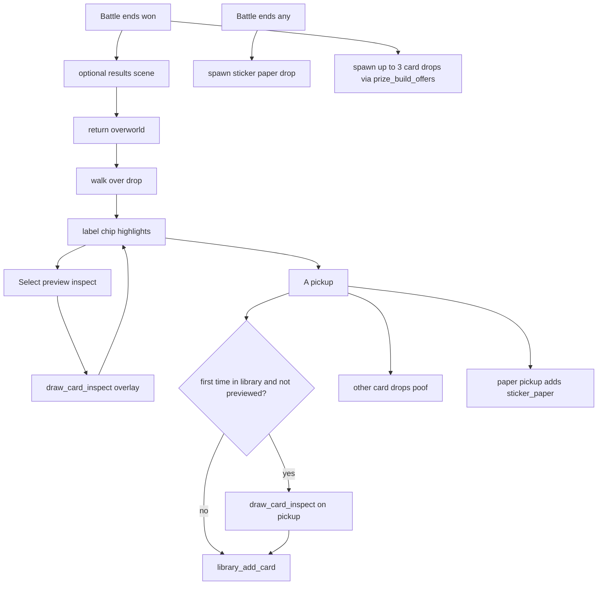

# RPG overworld MVP plan

**Status:** Planning — handoff doc for Cursor / new machine.  
**Branch:** `rpg-overworld` (create when implementing).  
**Supersedes:** overworld scrapped direction in older HANDOFF notes; roguelike run remains optional side content.

## Implementation checklist

- [ ] Create `rpg-overworld` branch; keep WIP `TextBoxPanel` for dialogue
- [ ] `main.cpp` boots overworld; Start → main menu
- [ ] One hub — collision, camera, Y-sort, walk + B-heelys
- [ ] `run_mode_battle` — no `run_campaign_prize_scene`; spawn drops on overworld return
- [ ] Ground loot — toss anim, labels, Select inspect, A pickup, poof, preview tracking
- [ ] NPC dialogue — Play / Shop / Goodbye with `TextBoxPanel`
- [ ] Scorekeeper, Shopkeeper, Wanderer — all modes wired
- [ ] Shopkeeper → `run_campaign_shop_scene` from dialogue
- [ ] SaveData v19 — position + per-NPC pending drop session

---

Mother-style hub, three NPCs, **Diablo 2–style loot on the ground** after battles instead of [`run_campaign_prize_scene`](../src/campaign_scenes.cpp) / [`run_prize_row_scene`](../src/prize_row_scene.cpp).

## MVP scope

| Entity | Role | `CampaignMode` |
|--------|------|----------------|
| Player | Walk; **B hold** = heelys | — |
| Scorekeeper (static) | Mode host | `BIGGEST_NUMBER` |
| Shopkeeper (static) | Shop + mode | `POKER_HAND` |
| Wanderer (path loop) | Mode host | `SAME_NUMBER` |

Boot **straight into overworld**. **Start** opens main menu (deck build / dev). One map, Mother dev sprites.

## Ground loot (Diablo-style)

After a battle, return to overworld **with items on the ground** — no card-pick screen.



### Drop rules

| Rule | Behavior |
|------|----------|
| **Card drops** | Only on **win**; up to **3** offers from [`prize_build_offers`](../src/prize_system.cpp) |
| **Pick one** | **A** picks one card; other card drops **poof** |
| **Sticker paper** | Drops after **any** completed battle (win or loss, not early exit); picked up adds to inventory |
| **Collection full** | Empty prize slots → **extra sticker paper** |
| **All cards exhausted** | All 3 slots → sticker paper |
| **Rematch same NPC** | Clears unpicked drops from previous fight |
| **Persistence** | Pending drops saved per NPC until picked or rematch |

### Interaction (walk proximity, not mouse)

| Action | Behavior |
|--------|----------|
| Walk over drop | Label chip selects (brighter bg, rarity-colored text) |
| **Select** | Card inspect overlay — [`draw_card_inspect`](../include/ui_inspect.h), same layout as deck editor |
| **Select** / **B** | Close inspect; drop **not** picked up |
| **A** | Pick up (when inspect not open) |
| First pickup | If first library add **and** not previewed via Select → inspect once on pickup |

### Loot labels (rarity chip)

**Not** `TextBoxPanel`. Tight chip: rarity-tinted backing + text, sized to label only.

| State | Background | Text |
|-------|------------|------|
| Default | Rarity color, dim (~40–50% feel via palette) | **White** |
| Selected | Same rarity, more opaque | **Rarity color** |

Sticker paper: neutral dim → bright backing; white → cream/gold text when selected. **Select** → `draw_text_inspect` (not card layout).

### Toss / poof

- **Toss:** arc from above landing tile (~20–30 frames)
- **Poof:** unpicked cards when another is taken; paper remains pickable

### Drop placement

Near **player return position**, spread horizontally (~16–24px).

## Player locomotion

- **Default:** walk (full leg cycle)
- **B hold:** heelys — kickoff → glide (wiggle every ~3rd cycle) → stop on B release
- States: `IdleStanding`, `WalkCycle`, `HeelysKickoff`, `HeelysGlide`, `HeelysStop`

## NPC dialogue

`TextBoxPanel` for story pages. Shopkeeper: **Shop** / **Play Poker Hand** / **Goodbye**. Others: **Play** / **Goodbye**.

## `overworld_drops` module

```
include/overworld_drops.h
src/overworld_drops.cpp
```

Key APIs: `overworld_drops_begin_session`, `overworld_drops_clear_session`, `overworld_drops_try_inspect` (Select), `overworld_drops_try_pickup` (A), `overworld_drops_inspect_active`.

Track `drop.previewed` to skip duplicate inspect on first pickup.

## Battle pipeline

Extract `run_mode_battle(CampaignMode, rng)` from [`campaign_flow.cpp`](../src/campaign_flow.cpp). **Do not call** `run_campaign_prize_scene` from overworld path. Optional: keep `run_campaign_battle_results_scene`.

## SaveData v19 (minimal)

`world_map_id`, `world_player_x/y`, `world_facing`, per-NPC `SavedDropSession` (active drops until picked or rematch).

## Phased delivery

1. Hub + player movement
2. `run_mode_battle` + drops (Scorekeeper)
3. All 3 NPCs + shop + wanderer
4. Save position + drop sessions

## Sprite spec (Mother-style, GBA)

### Map

| Asset | Size |
|-------|------|
| Tiles | **16×16** per cell |
| Tileset BMP | Multiple of 16 |

### Characters (player + all NPCs — same frame size)

| Spec | Size |
|------|------|
| **Recommended frame** | **24×32 px** (3×4 tiles) |
| **Lean alternate** | **16×24 px** (2×3 tiles) |
| **Collision at feet** | ~**14×14** |
| **Walk cycle** | 4 frames / direction (+ H-flip for left) |

### Animation sheets (24×32 example)

| Animation | Frames | Sheet width example |
|-----------|--------|---------------------|
| Idle | 1–2 | 24×32 |
| Walk | 4 per dir | 96×32 per row |
| Heelys glide | 1–2 | 24–48×32 |
| Heelys kickoff / stop | 2–4 | 48–96×32 |

### Loot (mostly code-generated)

| Drop | Size | Source |
|------|------|--------|
| Card on ground | ~32×48 scaled | Existing card display |
| Paper pile | 16×16 optional | Paper card art or small icon |
| Labels | 8×16 font | Procedural rarity chip |

### Required Mother dev BMPs (`graphics/mother_dev/`)

- Player: idle, walk, heelys (kickoff/glide/stop optional for MVP)
- NPC scorekeeper idle
- NPC shopkeeper idle
- NPC wanderer idle + walk
- Hub tileset (optional — procedural map OK for first compile)

Indexed BMP, index 0 = transparent, dimensions multiple of 8.

## Module layout

```
include/
  overworld_scene.h, overworld_map.h, overworld_player.h
  overworld_entity.h, dialogue_system.h, overworld_battle.h
  overworld_drops.h, world_data.h
src/
  matching .cpp files
```

Keep overworld headers thin — battle via `game_scene.h`, not `game_context.h`.

## Post-MVP (deferred)

- 7 mode NPCs, multi-map, warps
- `overworld_flow` (room locks, follow, scripted paths)
- Story flags, achievements, subplots
- Dramatic NPC movement flows

## WIP on branch (pre-overworld)

| Change | Use |
|--------|-----|
| `TextBoxPanel` in `ui_common` | NPC dialogue |
| Shutdown sprite clears | Battle stability |
| Discard-on-Down in `game_input` | Optional / unrelated |

## Cursor bootstrap prompt

```
Read docs/RPG_OVERWORLD_MVP_PLAN.md and implement Step 1 on branch rpg-overworld.
Mother sprites are dev placeholders in graphics/mother_dev/.
Do not commit unless asked.
```
